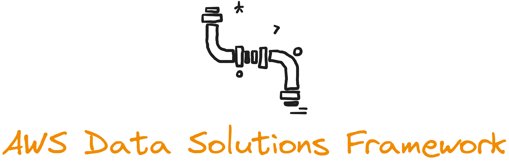

# AWS Data Solutions Framework

AWS Data Solutions Framework (AWS DSF) is a framework for implementation and delivery of analytics solutions with built-in AWS best practices. AWS DSF is an abstraction atop AWS services based on [AWS Cloud Development Kit](https://aws.amazon.com/cdk/) (CDK) [L3 constructs](https://docs.aws.amazon.com/cdk/v2/guide/constructs.html), packaged as a library.

AWS team has built several ready-to-deploy solutions using AWS DSF, that address the most common data analytics requirements. You can leverage AWS DSF to implement your data platform in weeks rather than in months.

- AWS DSF is available in TypeScript and Python.
- You can build custom solutions using AWS DSF.
- You can deploy AWS DSF solutions built by AWS.
- You can easily customize solutions, and integrate with the rest of your platform.

**Get started** by exploring available [solutions](./solutions/) and the [framework](./framework/)!

## Security
See [CONTRIBUTING](CONTRIBUTING.md#security-issue-notifications) for more information.

## License
This library is licensed under the MIT-0 License. See the [LICENSE](LICENSE) file.

## Feedback
We'd love to hear from you! Please create [GitHub issues](https://github.com/awslabs/aws-data-solutions-framework/issues) for additional features or solutions you'd like to see.