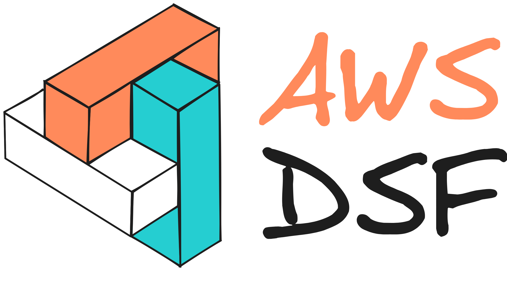

# AWS Data Solutions Framework

AWS Data Solutions Framework (AWS DSF) is a framework for implementation and delivery of data solutions with built-in AWS best practices. AWS DSF is an abstraction atop AWS services based on [AWS Cloud Development Kit](https://aws.amazon.com/cdk/) (CDK) L3 constructs, packaged as a library.

➡️ **More information on our [website](https://awslabs.github.io/aws-data-solutions-framework)**
