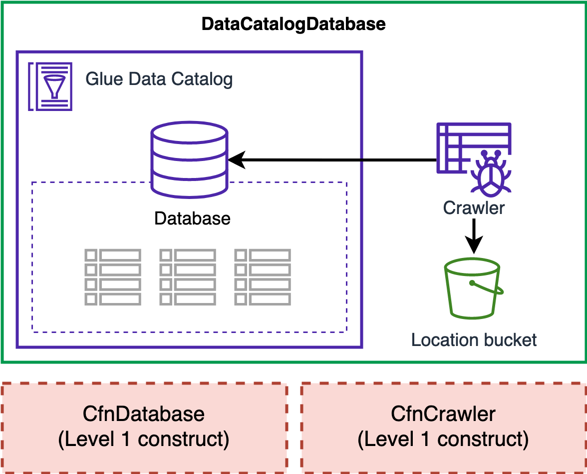
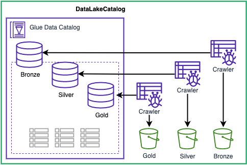
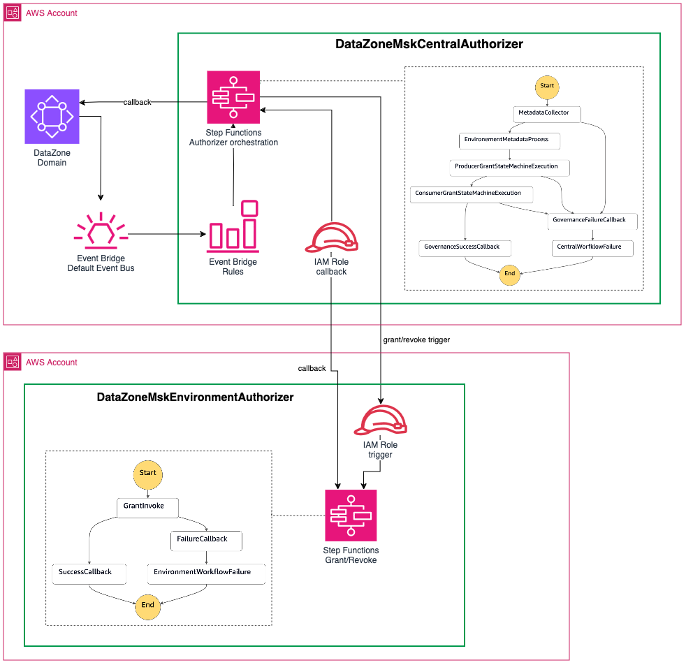
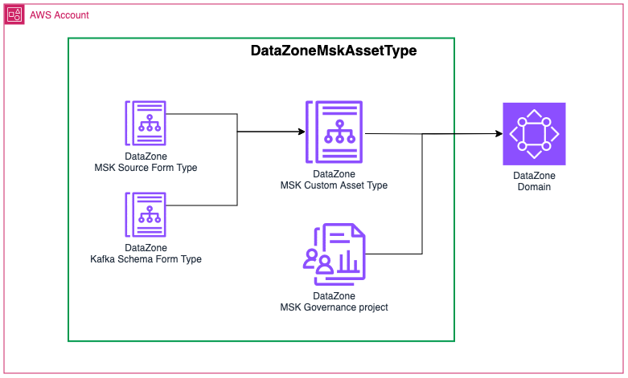

[//]: # (governance.data-catalog-database)
# DataCatalogDatabase

AWS Glue Catalog database for an Amazon S3 dataset.

## Overview

`DataCatalogDatabase` is an [AWS Glue Data Catalog Database](https://docs.aws.amazon.com/glue/latest/dg/define-database.html) configured for an Amazon S3 based dataset:
- The database default location is pointing to an S3 bucket location `s3://<locationBucket>/<locationPrefix>/`
- The database can store various tables structured in their respective prefixes, for example: `s3://<locationBucket>/<locationPrefix>/<table_prefix>/`
- By default, a database level crawler is scheduled to run once a day (00:01h local timezone). The crawler can be disabled and the schedule/frequency of the crawler can be modified with a cron expression.

:::caution Data Catalog encryption
The AWS Glue Data Catalog resources created by the `DataCatalogDatabase` construct are not encrypted because the encryption is only available at the catalog level. Changing the encryption at the catalog level has a wide impact on existing Glue resources and producers/consumers. Similarly, changing the encryption configuration at the catalog level after this construct is deployed can break all the resources created as part of DSF on AWS.
:::caution

## Usage

[example default usage](./examples/data-catalog-database-default.lit.ts)

## Modifying the crawler behavior

You can change the default configuration of the AWS Glue Crawler to match your requirements:
* Enable or disable the crawler
* Change the crawler run frequency
* Provide your own key to encrypt the crawler logs

[example crawler configuration](./examples/data-catalog-database-crawler.lit.ts)

[//]: # (governance.data-lake-catalog)
# DataLakeCatalog

AWS Glue Catalog databases on top of a DataLakeStorage.

## Overview

`DataLakeCatalog` is a data catalog for your data lake. It's a set of [AWS Glue Data Catalog Databases](https://docs.aws.amazon.com/glue/latest/dg/define-database.html) configured on top of a [`DataLakeStorage`](../storage/README.md#datalakestorage).
The construct creates three databases pointing to the respective medallion layers (bronze, silve or gold) of the `DataLakeStorage`:
- The database default location is pointing to the corresponding S3 bucket location `s3://<locationBucket>/<locationPrefix>/`
- By default, each database has an active crawler scheduled to run once a day (00:01h local timezone). The crawler can be disabled and the schedule/frequency of the crawler can be modified with a cron expression.

:::caution Data Catalog encryption
The AWS Glue Data Catalog resources created by the `DataCatalogDatabase` construct are not encrypted because the encryption is only available at the catalog level. Changing the encryption at the catalog level has a wide impact on existing Glue resources and producers/consumers. Similarly, changing the encryption configuration at the catalog level after this construct is deployed can break all the resources created as part of DSF on AWS.
:::caution

## Usage

[example default usage](./examples/data-lake-catalog-default.lit.ts)

## Modifying the crawlers behavior for the entire catalog

You can change the default configuration of the AWS Glue Crawlers associated with the different databases to match your requirements:
* Enable or disable the crawlers
* Change the crawlers run frequency
* Provide your own key to encrypt the crawlers logs

The parameters apply to the three databases, if you need fine-grained configuration per database, you can use the [DataCatalogDatabase](#datacatalogdatabase) construct.

[example crawler configuration](./examples/data-lake-catalog-crawler.lit.ts)

[//]: # (governance.datazone-msk-authorizer)
# DataZoneMskAuthorizer

Custom DataZone MSK authorizer for granting access to MSK topics via DataZone asset subscription workflow.

## Overview

The DataZone MSK Authorizer is a custom process integrated with DataZone that implements the [Subscription Grant](https://docs.aws.amazon.com/datazone/latest/userguide/grant-access-to-unmanaged-asset.html) concept for Kafka topics hosted on Amazon MSK (provisioned and Serverless), 
secured by IAM policies, and registered in DataZone using the `DataZoneMskAssetType`. 
It supports:
- cross account access with MSK Provisioned clusters.
- MSK managed VPC connectivity permissions with MSK Provisioned clusters
- Glue Schema Registry permissions when sharing in the same account

The authorizer is composed of 2 constructs: 
- the `DataZoneMskCentralAuthorizer` is responsible for collecting metadata on the Subscription Grant, orchestrating the workflow and acknowledging the Subscription Grant creation. This construct must be deployed in the AWS root account of the DataZone Domain. 
- the `DataZoneMskEnvironmentAuthorizer` is responsible for managing the permissions on the producer and consumer side. This construct must be deployed once per account associated with the DataZone Domain.

The cross-account synchronization is exclusively done via EventBridge bus to restrict cross account permissions to the minimum.

## DataZoneMskCentralAuthorizer

The `DataZoneMskCentralAuthorizer` is the central component that receives all the Subscription Grant Requests from DataZone for the `MskTopicAssetType` and orchestrate the end-to-end workflow. 
The workflow is a Step Functions State Machine that is triggered by [events emmitted by DataZone](https://docs.aws.amazon.com/datazone/latest/userguide/working-with-events-and-notifications.html) and contains the following steps:
1. Metadata collection: a Lambda Function collect additional information from DataZone on the producer, the subscriber and update the status of the Subscription Grant to `IN_PROGESS`.
2. Producer grant trigger: an event is sent to the producer account to request the creation of the grant on the producer MSK cluster (implemented in the `DataZoneMskEnvironmentAuthorizer`). This step is an asynchronous state using a callback mechanism from the `DataZoneMskEnvironmentAuthorizer`.
3. Consumer grant trigger: an event is sent to the consumer account to request the creation of the grant on the IAM consumer Role (implemented in the `DataZoneMskEnvironmentAuthorizer`). This step is an asynchronous state using a callback mechanism from the `DataZoneMskEnvironmentAuthorizer`.
4. DataZone Subscription Grant callback: a Lambda Function updates the status of the Subscription Grant in DataZone to `GRANTED` or `REVOKE` based on the initial request.

If any failure happens during the process, the Step Functions catch the exceptions and updates the status of the Subscription Grant to `GRANT_FAILED` or `REVOKE_FAILED`.

:::info Permission grant failure
If the grant fails for the consumer, the grant already done for the producer is not reverted but the user is notified within DataZone because the failure is propagated. 
The authorizer process is idempotent so it's safe to replay the workflow and all the permissions will be deduplicated. If it's not replayed, the producer grant needs to be manually cleaned up. 
:::

### Usage

[example default usage](./examples/datazone-msk-central-authorizer-default.lit.ts)

### Register producer and consumer accounts 

The `DataZoneMskCentralAuthorizer` construct work in collaboration with the `DataZoneMskEnvironmentAuthorizer` construct which is deployed into the producers and consumers accounts.
To enable the integration, register accounts using the `registerAccount()` method on the `DataZoneMskCentralAuthorizer` object. 
It will grant the required permissions so the central account and the environment accounts can communicate via EventBridge events. 

[example register account](./examples/datazone-msk-central-authorizer-register.lit.ts)

## DataZoneMskEnvironmentAuthorizer

The `DataZoneMskEnvironmentAuthorizer` is responsible from managing the permissions required to grant access on MSK Topics (and associated Glue Schema Registry) via IAM policies. 
The workflow is a Step Functions State Machine that is triggered by events emitted by the `DataZoneMskCentralAuthorizer` and contains the following steps:
1. Grant the producer or consumer based on the request. If the event is a cross-account producer grant, a Lambda function adds an IAM policy statement to the MSK Cluster policy granting read access to the IAM consumer Role. Optionally, it can also grant the use of MSK Managed VPC.
2. Callback the `DataZoneMskCentralAuthorizer`: an EventBridge event is sent on the central EventBridge Bus to continue the workflow on the central account using the callback mechanism of Step Functions.

### Usage

[example default usage](./examples/datazone-msk-environment-authorizer-default.lit.ts)

### Cross account workflow

If the `DataZoneMskEnvironmentAuthorizer` is deployed in a different account than the DataZone root account where the `DataZoneMskCentralAuthorizer` is deployed, you need to configure the central account ID to authorize cross-account communication:

[example cross account](./examples/datazone-msk-environment-authorizer-cross-account.lit.ts)

### Granting MSK Managed VPC connectivity

For easier cross-account Kafka consumption, MSK Provisioned clusters can use the [multi-VPC private connectivity](https://docs.aws.amazon.com/msk/latest/developerguide/aws-access-mult-vpc.html) feature which is a managed solution that simplifies the networking infrastructure for multi-VPC and cross-account connectivity.

By default, the multi-VPC private connectivity permissions are not configured. You can enable it using the construct properties:

[example vpc](./examples/datazone-msk-environment-authorizer-vpc.lit.ts)

[//]: # (governance.datazone-msk-asset-type)
# DataZoneMskAssetType

DataZone custom asset type for MSK topics.

## Overview

`DataZoneMskAssetType` is a custom asset type implementation for Kafka topics hosted in MSK clusters. MSK clusters can be provisioned or serverless. Topics can be linked to a Glue Schema Registry. 
The construct is a CDK custom resource that creates the corresponding DataZone Form Types and Asset Type required to store metadata related to MSK Topics. It includes:
- A MSK Source Reference Form Type containing metadata about the MSK Cluster including the cluster ARN and type. 
- A Kafka Schema For Type containing metadata about the topic including the topic name, schema version, Glue Schema Registry ARN and Glue Schema ARN.

## Usage

[example default usage](./examples/datazone-msk-asset-type-default.lit.ts)

## Reusing an existing owner project

The `DataZoneMskAssetType` requires a DataZone project to own the custom asset type. By default, it will create a `MskGovernance` project within the domain but you pass an existing project. 
The construct will make the IAM custom resource Role a member of the projectto be able to create the asset type and the form types.

[example project](./examples/datazone-msk-asset-type-project.lit.ts)

## Reusing a Custom Asset Type Factory

By default, the `DataZoneMskAssetType` creates its own factory resources required to connect to DataZone and create the custom asset type. But it's possible to reuse a Factory across multiple Custom Asset Types to limit the number of custom resource providers and DataZone project membership:

[example factory configuration](./examples/datazone-msk-asset-type-factory.lit.ts)

[//]: # (governance.datazone-gsr-msk-datasource)
# DataZoneGsrMskDataSource

DataZone Data Source for MSK Topics assets backed by Glue Schema Registry.

## Overview

`DataZoneGsrMskDataSource` is custom data source for DataZone that can create/update/delete MSK topics assets in DataZone based on a Glue Schema Registry definition. The custom data source can be triggered by a schedule or based on events from the Glue Schema Registry. The constructs implement:
- EventBridge Rules triggered either on a schedule or event based.
- A Lambda Function triggered from the EventBridge Rules and responsible for collecting metadata from The Glue Schema Registry and updating MSK Topic assets in DataZone.
- SSM Parameter Store Parameters to store required metadata

## Usage

[example default usage](./examples/datazone-gsr-msk-datasource-default.lit.ts)

## Data Source trigger modes

The custom data source process can be triggered in two different ways. By default, if no schedule and events are not enabled, the construct creates a schedule every one hour.
- Based on a Schedule

[example schedule](./examples/datazone-gsr-msk-datasource-cron.lit.ts)

- Based on events received from the Glue Schema Registry

[example events](./examples/datazone-gsr-msk-datasource-event.lit.ts)