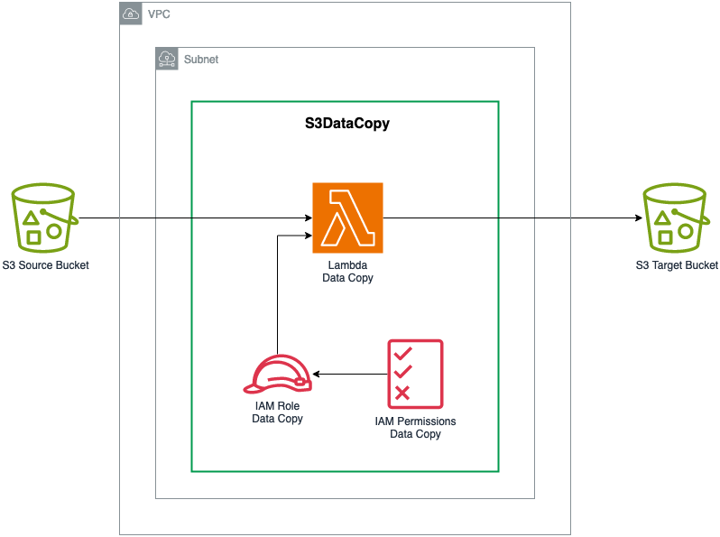

[//]: # (utils.s3-data-copy)
# S3DataCopy

Data copy from one bucket to another during deployment time.

## Overview

`S3DataCopy` construct provides a process to copy objects from one bucket to another during CDK deployment time:
- The copy is part of the CDK and CloudFormation deployment process. It's using a synchronous CDK Custom Resource running on AWS Lambda.
- The Lambda function is written in Typescript and copies objects between source and target buckets.
- The execution role used by the Lambda function is scoped to the least privileges. A custom role can be provided.
- The Lambda function can be executed in an Amazon VPC within private subnets. By default, it runs run inside VPCs owned by the AWS Lambda service.
- The Lambda function is granted read access on the source bucket and write access on the destination bucket using the execution role policy. The construct doesn't grant cross account access.



## Usage

[example defaults](./examples/s3-data-copy.lit.ts)

## Private networks

The lambda Function used by the custom resource can be deployed in a VPC by passing the VPC and a list of private subnets.

Public subnets are not supported.

[example vpc](./examples/s3-data-copy-vpc.lit.ts)

[//]: # (utils.data-vpc)
# DataVpc

Amazon VPC optimized for data environments.

## Overview

`DataVpc` construct provides a standard Amazon VPC with best practices for security and data environments implementations:
- The VPC is created with public and private subnets across 3 availability zones (1 of each per AZ) and 3 NAT gateways.
- VPC CIDR mask should be larger than 28. The CIDR is split between public and private subnets with private subnets being twice as large as public subnet. 
- The flow logs maaged by a dedicated least-privilege IAM Role. The role can be customized.
- The flow logs exported to an Amazon CloudWatch LogGroup encrypted with an Amazon KMS customer managed key. The KMS key can be customized.
- A gateway VPC endpoint is created for S3 access.

## Usage

[example default](./examples/data-vpc-default.lit.ts)


## VPC Flow Logs

The construct logs VPC Flow logs in a Cloudwatch Log Group that is encrypted with a customer managed KMS Key. Exporting VPC Flow Logs to CloudWatch requires an IAM Role. 
You can customize the VPC Flow Logs management with:
- your own KMS Key. Be sure to attach the right permissions to your key. 
Refer to the [AWS documentation](https://docs.aws.amazon.com/AmazonCloudWatch/latest/logs/encrypt-log-data-kms.html) for full description.
- your own IAM Role. Be sure to configure the proper trust policy and permissions. Refer to the [AWS documentation](https://docs.aws.amazon.com/vpc/latest/userguide/flow-logs-cwl.html#flow-logs-iam-role) for full description.
- a custom log retention policy. Default is one week.

[example custom KMS Key and IAM Role](./examples/data-vpc-flowlog.lit.ts)

## Removal policy

You can specify if the Cloudwatch Log Group and the KMS encryption Key should be deleted when the CDK resource is destroyed using `removalPolicy`. To have an additional layer of protection, we require users to set a global context value for data removal in their CDK applications.

Log group and encryption key can be destroyed when the CDK resource is destroyed only if **both** data vpc removal policy and DSF on AWS global removal policy are set to remove objects.

You can set `@data-solutions-framework-on-aws/removeDataOnDestroy` (`true` or `false`) global data removal policy in `cdk.json`:

```json title="cdk.json"
{
  "context": {
    "@data-solutions-framework-on-aws/removeDataOnDestroy": true
  }
}
```

Or programmatically in your CDK app:

[example object removal](./examples/data-vpc-removal.lit.ts)

[//]: # (utils.customization)
# Customize DSF on AWS constructs

You can customize DSF on AWS constructs in several ways to adapt to your specific needs:
1. Use the Constructs properties instead of the smart defaults.
2. Extend existing constructs and override specific methods or properties.
3. Access CDK L1 resources and override any property.


## Constructs properties

Use the properties of the construct to adapt the behavior to your needs. With this approach, you bypass the smart defaults provided by the construct.
Refer to the documentation of each construct to evaluate if your requirements can be implemented.

:::note
This method should always be preferred because constructs properties are tested as part of the DSF on AWS build process.
:::

For example, you can use the `DataLakeStorage` properties to modify the lifecycle configurations for transitioning objects based on your needs instead of using the default rules:

[example construct parameters](../storage/examples/data-lake-storage-lifecycle.lit.ts)

## Construct extension

AWS CDK allows developers to extend classes like any object-oriented programing language. You can use this method when you want to:
* Override a specific method exposed by a construct.
* Implement your own defaults. Refer to the example of the [`AnalyticsBucket`](https://github.com/awslabs/data-solutions-framework-on-aws/blob/main/framework/src/storage/analytics-bucket.ts) that extends the CDK L2 `Bucket` construct to enforce some of the parameters.

## CDK resources override

AWS CDK offers escape hatches to modify constructs that are encapsulated in DSF on AWS constructs. The constructs always expose the AWS resources that are encapsulated so you can manually modify their configuration. For achieving this you have 3 options:

* Modify the L2 construct using its CDK API. For example, you can modify the buckets' policies provided by the [`DataLakeStorage`](https://awslabs.github.io/data-solutions-framework-on-aws/docs/constructs/library/data-lake-storage) to provide cross account write access. All the [buckets](https://docs.aws.amazon.com/cdk/api/v2/docs/aws-cdk-lib.aws_s3.Bucket.html) L2 constructs are exposed as an object parameter:

[example customization l2](./examples/customization-l2.lit.ts)

* [Modify the L1 construct resource](https://docs.aws.amazon.com/cdk/v2/guide/cfn_layer.html#cfn_layer_resource) when there is a CDK property available on the L1 construct.
  For example, you can override CDK L1 property for setting the S3 transfer Acceleration on the gold bucket of the `DataLakeStorage`:

[example customization l1](./examples/customization-l1.lit.ts)

* [Override the CloudFormation properties](https://docs.aws.amazon.com/cdk/v2/guide/cfn_layer.html#cfn_layer_raw) when there isn't any CDK property, and you need to modify the CFN template directly.
  For example, you can override CloudFormation property for setting the S3 transfer Acceleration on the gold bucket of the `DataLakeStorage`:

[example customization cfn](./examples/customization-cfn.lit.ts)

[//]: # (utils.custom-resources)
# Create custom resources with the DsfProvider

DSF provides an internal construct named `DsfProvider` to facilitate the creation of custom resources in DSF constructs. 
The `DsfProvider` construct handles the undifferentiated tasks for you so you can focus on the custom resource logic. 
This construct is an opinionated implementation of the [CDK Custom Resource Provider Framework](https://docs.aws.amazon.com/cdk/api/v2/docs/aws-cdk-lib-readme.html#the-custom-resource-provider-framework). 
It creates:
* A custom resource provider to manage the entire custom resource lifecycle
* An onEvent Lambda function from the provided code to perform actions you need in your custom resource
* An optional isComplete Lambda function from the provided code when using [asynchronous custom resources](https://docs.aws.amazon.com/cdk/api/v2/docs/aws-cdk-lib.custom_resources-readme.html#asynchronous-providers-iscomplete)
* CloudWatch Logs log groups for each Lambda function
* IAM roles for each Lambda function and associated permissions

:::note
You still need to provide an IAM Managed Policy required by the actions of the Lambda functions.
:::

## Configuring handlers for the custom resource

The `DsfProvider` construct requires a Lambda function handler called `onEvent` to perform the actions of the custom resource. It also supports an optional Lambda function handler called `isComplete` to regularly perform status checks for asynchronous operation triggered in the `onEvent` handler.

Both Lambda functions are implemented in Typescript. 
`esbuild` is used to package the Lambda code and is automatically installed by `Projen`. If `esbuild` is available, `docker` will be used. 
You need to configure the path of the Lambda code (entry file) and the path of the dependency lock file (`package-lock.json`) for each handler.

To generate the `package-lock.json` file, run from the Lambda code folder:

```bash
npm install --package-lock-only
```

Then you can configure the `onEvent` and `isComplete` handlers in the `DsfProvider` construct:

[example handlers](./examples/dsf-provider-is-complete.lit.ts)

## Packaging dependencies in the Lambda function

Dependencies can be added to the Lambda handlers using the bundling options. For example, the following code adds the AWS SDK S3 client to the `onEvent` handler:

[example bundling](./examples/dsf-provider-bundling.lit.ts)

## Running the Custom Resource in VPC

You can configure the `DsfProvider` to run all the Lambda functions within a VPC (for example in private subnets). It includes the Lambda handlers (`onEvent` and `isComplete`) and the Lambda functions used by the custom resource framework. The following configurations are available when running the custom resource in a VPC:
 * The VPC where you want to run the custom resource.
 * The subnets where you want to run the Lambda functions. Subnets are optional. If not configured, the construct uses the VPC default strategy to select subnets. 
 * The EC2 security groups to attach to the Lambda functions. Security groups are optional. If not configured, a single security group is created for all the Lambda functions.

:::danger
The `DsfProvider` construct implements a custom process to efficiently clean up ENIs when deleting the custom resource. Without this process it can take up to one hour to delete the ENI and dependant resources. 
This process requires the security groups to be dedicated to the custom resource. If you configure security groups, ensure they are dedicated.
:::

[example vpc](./examples/dsf-provider-vpc.lit.ts)

## Configuring environment variables of Lambda handlers

Lambda handlers can leverage environment variables to pass values to the Lambda code. You can configure environment variables for each of the Lambda handlers:

[example env](./examples/dsf-provider-env.lit.ts)

## Removal policy

You can specify if the Cloudwatch Log Groups should be deleted when the CDK resource is destroyed using `removalPolicy`. To have an additional layer of protection, we require users to set a global context value for data removal in their CDK applications.

Log groups can be destroyed when the CDK resource is destroyed only if **both** `DsfProvider` removal policy and DSF on AWS global removal policy are set to remove objects.

You can set `@data-solutions-framework-on-aws/removeDataOnDestroy` (`true` or `false`) global data removal policy in `cdk.json`:

```json title="cdk.json"
{
  "context": {
    "@data-solutions-framework-on-aws/removeDataOnDestroy": true
  }
}
```

Or programmatically in your CDK app:

[example log group removal](./examples/dsf-provider-removal-policy.lit.ts)
