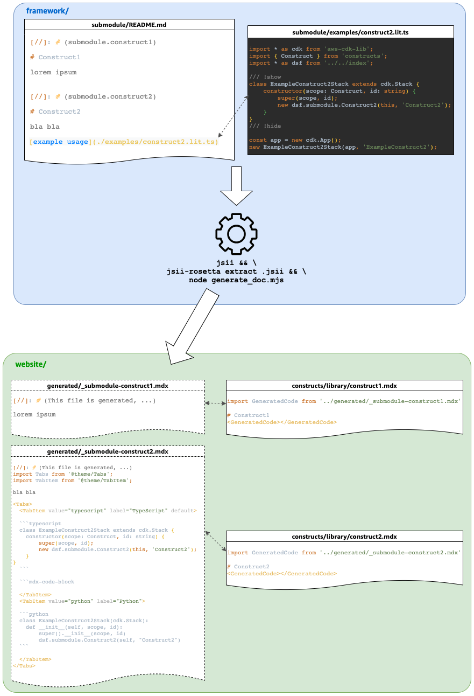

# Documentation and code examples

Constructs in DSF on AWS are documented in two different places:
- In the constructs themselves,
- In a `README.md` file associated to each submodule (layer).

We aim to provide accurate code examples that actually match the DSF on AWS API and compile. This page explains how you should write doc and examples to achieve this.

## Constructs
In the constructs themselves, there is a small description, a (basic) usage example and a link to the website. 
This documentation will be accessible in [ConstructHub](https://constructs.dev/). 
The example must be identified by the `@example` tag in the comment of the construct and must be written in typescript. 
The code will be compiled and "transliterated" in other programming languages by `jsii` and `jsii-rosetta`, so it must compile. 
To compile the code, rosetta will leverage _fixtures_ where you can define the imports and everything that wrap the code you want to showcase. 
Most of the examples in DSF on AWS leverage the default fixture [`default.ts-fixture`](https://github.com/awslabs/data-solutions-framework-on-aws/blob/main/framework/rosetta/default.ts-fixture):

```ts
import { Construct } from 'constructs';
import * as cdk from 'aws-cdk-lib';
import * as dsf from '@cdklabs/aws-data-solutions-framework';

class MyStack extends cdk.Stack {
  constructor(scope: Construct, id: string) {
    super(scope, id);

    /// here
  }
}
```

The example will be inserted at the place of the comment: `/// here`. Fixtures code are not displayed in the documentation, they are only used for the compilation and transliteration.

If you need another fixture, you can either use the [`imports-only.ts-fixture`](https://github.com/awslabs/data-solutions-framework-on-aws/blob/main/framework/rosetta/imports-only.ts-fixture) or write your own in the [`rosetta`](https://github.com/awslabs/data-solutions-framework-on-aws/blob/main/framework/rosetta/default.ts-fixture) folder. Then, to specify the fixture in your comment, use the following syntax:

```ts
@exampleMetadata fixture=imports-only
@example
```

## Submodule README.md
The submodule README will contain the documentation for all the constructs within this submodule. 
Submodules must be named (e.g. "_storage_", "_processing_", "_governance_", ..., see [index.ts](https://github.com/awslabs/data-solutions-framework-on-aws/blob/main/framework/src/index.ts)):
```ts
export * as storage from './storage';
export * as governance from './governance';
export * as processing from './processing';
```

The content of the README will be available in ConstructHub. 
The content will also be used to generate part of the website. 
This generation process is described in the following picture:



There are a few important things to notice:
- The `README.md` file contains comments in the form of `[//]: # (submodule.construct1)` to distinguish the different constructs. If a new construct is added in the submodule, and thus in the documentation, add this comment before the H1 title. Also do not use comments in the README outside of this usage.
- Code snippets and examples relative to constructs should not be written directly inside the README but rather in a `.lit.ts` file within the `examples` directory of the submodule and referenced in the README using the syntax `[example ...](./examples/file.lit.ts)`. The description must start with `example` and the file extension must be `.lit.ts`.
- `.lit.ts` files are standard typescript files that must compile (this is the aim of it, make sure our examples are accurate and compile). These files contain comments `/// !show` and `/// !hide` to tell what part of the code must be shown in the final documentation. You can have several of these comments and also use `/// a comment` to add standard text between small snippets of code.
- The website documentation page relative to a construct should only contain the title (generally the name of the construct) and an import of some generated doc/code.
- The documentation and code examples are built thanks to several tools and scripts:
    - [`jsii`](https://github.com/aws/jsii) which is the technology used by CDK to deliver a polyglot technology (supporting multiple programming languages). `jsii` generates an assembly file (`.jsii`) that contains all the information about the constructs, examples, and READMEs within the code.
    - [`jsii-rosetta`](https://github.com/aws/jsii-rosetta) that translate code examples in different languages. `jsii-rosetta` extract information from the `.jsii` file and generates a _tablet_ file (`.jsii.tabl.json`) that contains all the code examples and snippets translated in all languages supported by CDK/jsii.
    - [`generate_doc.mjs`](https://github.com/awslabs/data-solutions-framework-on-aws/blob/main/framework/generate_doc.mjs) is a custom nodeJS script that takes the README files, the tablet generated by `jsii-rosetta`, inject the code (python and typescript) at the good place in the README and split the submodule README in multiple markdown files (one per construct). These files are moved to the website folder structure to be imported by the main doc. 

:::warning Push the generated files to Git

The generated files should be committed and pushed to Git. `npx projen build` will also perform the process described above and the GitHub build action will check that generated files are up-to-date (_mutation check_).

:::

:::warning Do not edit generated files

The generated files are read-only and should not be edited manually. Instead, update the `README.md` file in the corresponding submodule.

:::

### Troubleshooting issues

It can happen that the documentation is not generated properly, for examples with examples not included in the doc, or shifted to another part.

In this case make sure to remove the `.jsii.tabl.json` file and regenerate the doc.

Also make sure there is no new line after a `/// !show` tag or before a `/// !hide` tag in your lit.ts files.

:x: The following example is incorrect:

```ts
/// !show

const virtualCluster = emrEksCluster.addEmrVirtualCluster(this, {
    name: 'dailyjob',
    createNamespace: true,
    eksNamespace: 'dailyjobns',
});

new cdk.CfnOutput(this, 'virtualClusterArn', {
    value: virtualCluster.attrArn,
});

/// !hide
```

:white_check_mark: The following one is correct:

```ts
/// !show
const virtualCluster = emrEksCluster.addEmrVirtualCluster(this, {
    name: 'dailyjob',
    createNamespace: true,
    eksNamespace: 'dailyjobns',
});

new cdk.CfnOutput(this, 'virtualClusterArn', {
    value: virtualCluster.attrArn,
});
/// !hide
```
