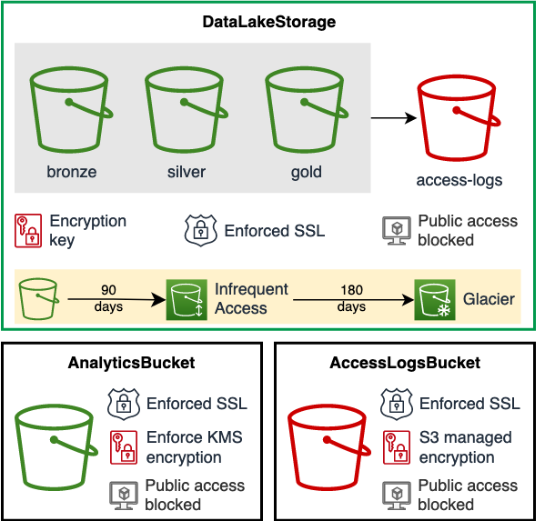

# DataLakeStorage

Data Lake based on medallion architecture and AWS best-practices.

## Overview

At the high level, `DataLakeStorage` creates three [Amazon S3](https://aws.amazon.com/s3) buckets configured specifically for data lake on AWS. By default these buckets are named *Bronze*, *Silver*, and *Gold* to represent [different data layers](https://docs.aws.amazon.com/prescriptive-guidance/latest/defining-bucket-names-data-lakes/data-layer-definitions.html). You can customize bucket names according to your needs.
`DataLakeStorage` uses [`AnalyticsBucket`](analytics-bucket) and [`AccessLogsBucket`](access-logs-bucket) constructs from AWS DSF, to create storage and access logs buckets respectively. Your data lake storage is encrypted using [AWS KMS](https://aws.amazon.com/kms/) customer managed bukcet key. You can also provide your own KMS Key. We provide data lifecycle management that you can customize to your needs. 

Here is the overview of `DataLakeStorage` features:
- Medalion design with S3 buckets for Bronze, Silver, and Gold data.
- Server-side encryption using a single KMS customer key for all S3 buckets. 
- Enforced SSL in-transit encryption.
- Logs data lake access in a dedicated bucket within a prefix matching the bucket name.
- Buckets, objects and encryption keys can be retained when the CDK resource is destroyed (default).
- All public access blocked.




## Objects removal

You can specify if buckets, objects and encryption keys should be deleted when the CDK resource is destroyed using `removalPolicy`. To have an additional layer of protection, we require users to set a global context value for data removal in their CDK applications. 

Buckets, objects and encryption keys can be destroyed when the CDK resource is destroyed only if **both** data lake removal policy and AWS DSF global removal policy are set to remove objects.

You can set `@aws-data-solutions-framework/removeDataOnDestroy` (`true` or `false`) global data removal policy in `cdk.json`:

```json title="cdk.json"
{
  "context": {
    "@aws-data-solutions-framework/removeDataOnDestroy": true,
  }
}
```

Or programmatically in your CDK app:

```python title="CDK app"
app = App()
stack = Stack(app, 'Stack')
# Set context value for global data removal policy
stack.node.set_context('@aws-data-solutions-framework/removeDataOnDestroy', True)
```

You will also need to set removal policy for `DataLakeStorage` when using the construct:
```python
DataLakeStorage(stack, 'DataLakeStorage',
  # ...
  removal_policy=RemovalPolicy.DESTROY,
  # ...
)

```

## Data lifecycle management
We provide a simple [data lifecycle management](https://aws.amazon.com/s3/storage-classes/) for data lake storage, that you can customize to your needs. By default:
  - Bronze data is moved to Infrequent Access after 30 days and archived to Glacier after 90 days.
  - Silver and Gold data is moved to Infrequent Access after 90 days and is not archived.

Change the data lifecycle rules using the DataLakeStorage properties:

```python
DataLakeStorage(stack, 'MyDataLakeStorage',
                bronze_infrequent_access_delay=90,
                bronze_archive_delay=180,
                silver_infrequent_access_delay=180,
                silver_archive_delay=360,
                gold_infrequent_access_delay=180,
                gold_archive_delay=360)
```
## Usage Example

```python
from aws_cdk import core
from aws_data_solutions_framework import DataLakeStorage
from aws_cdk.aws_s3 import RemovalPolicy

# Set context value for global data removal policy (or set in cdk.json).
stack.node.set_context('@aws-data-solutions-framework/removeDataOnDestroy', True)

DataLakeStorage(stack, 'MyDataLakeStorage',
                bronze_name='my-bronze',
                bronze_infrequent_access_delay=90,
                bronze_archive_delay=180,
                silver_name='my-silver',
                silver_infrequent_access_delay=180,
                silver_archive_delay=360,
                gold_name='my-gold',
                gold_infrequent_access_delay=180,
                gold_archive_delay=360,
                removal_policy=RemovalPolicy.RETAIN)
```
