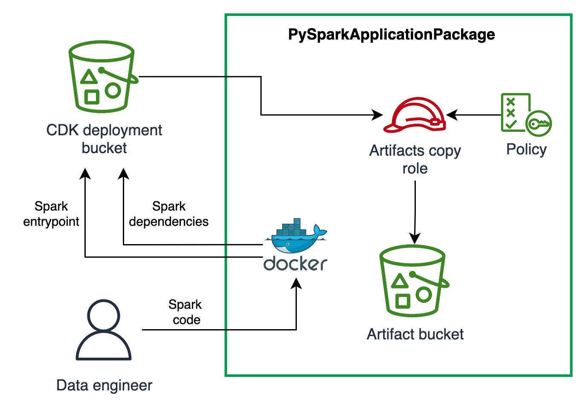

[//]: # (This file is generated, do not modify directly, update the README.md in framework/src/processing)
import Tabs from '@theme/Tabs';
import TabItem from '@theme/TabItem';

A PySpark application packaged with its dependencies and uploaded on an S3 artifact bucket.

## Overview

The construct package your PySpark application (the entrypoint, supporting files and virtual environment)
and upload it to an Amazon S3 bucket. In the rest of the documentation we call the entrypoint,
supporting files and virtual environment as artifacts.

The PySpark Application Package has two responsibilities:

* Upload your PySpark entrypoint application to an artifact bucket
* Package your PySpark virtual environment (venv) and upload it to an artifact bucket. The package of venv is done using docker,
  an example in the [Usage](#usage) section shows how to write the Dockerfile to package the application.

The construct uses the [Asset](https://docs.aws.amazon.com/cdk/api/v2/docs/aws-cdk-lib.aws_s3_assets.Asset.html)
to upload the PySpark Application artifacts to CDK Asset bucket. These are then copied to an S3 bucket we call artifact bucket.

To manage the lifecycle of the artifacts as CDK assets, the constructs need Docker daemon running on the local machine.
Make sure to have Docker running before using the construct.

### Construct attributes

The construct exposes the artifacts through the following interfaces:

* entrypointS3Uri: The S3 location where the entry point is saved in S3. You pass this location to your Spark job.
* venvArchiveS3Uri: The S3 location where the archive of the Python virtual environment with all dependencies is stored. You pass this location to your Spark job.
* sparkVenvConf: The Spark config containing the configuration of virtual environment archive with all dependencies.

### Resources created
* An Amazon S3 Bucket to store the PySpark Application artifacts. You can also provide your own if you have already a bucket that you want to use. This bucket comes with configuration to enforce `TLS`, `Block Public Access` and encrypt objects with `SSE-KMS`,
* An IAM role used by a Lambda to copy from the CDK Asset bucket to the artifact bucket created above or provided.

The schema below shows the resources created and the responsible of the construct:



## Usage

In this example we will show you how you can use the construct to package a PySpark application
and submit a job to EMR Serverless leveraging ADSF `SparkEmrServerlessRuntime` and `SparkJob` constructs.

For this example we assume we will have the folder structure as shown below. We have two folders, one containing
the `PySpark` application called `spark` folder and a second containing the `CDK` code called `cdk`.
The PySpark code, follows the standards `Python` structure. The `spark` also contains the `Dockerfile` to build the `venv`.
In the next [section](#dockerfile-definition) will describe how to structure the `Dockerfile`.

```bash
root
|--spark
|    |--test
|    |--src
|       |--__init__.py
|       |--entrypoint.py
|       |--dir1
|        |--__init__.py
|        |--helpers.py
|    |--requirement.txt
|    |--Dockerfile #contains the build instructions to package the virtual environment for PySpark
|--cdk #contains the CDK application that deploys CDK stack with the PySparkApplicationPackage
```
#### PySpark Application Definition

For this example we define the PySparkApplicationPackage resource as follows:

<Tabs>
  <TabItem value="typescript" label="TypeScript" default>

  ```typescript
new dsf.processing.PySparkApplicationPackage(this, 'PySparkApplicationPackage', {
    applicationName: 'nightly-job-aggregation',
    entrypointPath: './../spark/src/entrypoint.py',
    dependenciesFolder: './../spark',
    venvArchivePath: '/venv-package/pyspark-env.tar.gz',
});
  ```
  
  ```mdx-code-block
  
  </TabItem>
  <TabItem value="python" label="Python">

  ```python
dsf.processing.PySparkApplicationPackage(self, "PySparkApplicationPackage",
    application_name="nightly-job-aggregation",
    entrypoint_path="./../spark/src/entrypoint.py",
    dependencies_folder="./../spark",
    venv_archive_path="/venv-package/pyspark-env.tar.gz"
)
  ```

  </TabItem>
</Tabs>

### Dockerfile definition

The steps below describe how to create the `Dockerfile` so it can be used to be package `venv` by the construct

* In order to build the virtual environment, the docker container will mount the `dependencies_folder`, in our case we define it as `./../spark`.
* Then to package the `venv` we need to build `COPY` all the files in `./spark` to the docker container.
* Last we execute the `venv-package`, in the [PySparkApplication](#pyspark-application-definition) we passed the `venv_archive_path` as `/venv-package/pyspark-env.tar.gz`.
  So we need to create it with `mkdir /venv-package` and then pass it to the `venv-package` as `venv-pack -o /venv-package/pyspark-env.tar.gz`

```Dockerfile
FROM --platform=linux/amd64 public.ecr.aws/amazonlinux/amazonlinux:latest AS base

RUN dnf install -y python3

ENV VIRTUAL_ENV=/opt/venv
RUN python3 -m venv $VIRTUAL_ENV
ENV PATH="$VIRTUAL_ENV/bin:$PATH"

COPY . .

RUN python3 -m pip install --upgrade pip && \
    python3 -m pip install venv-pack==0.2.0 && \
    python3 -m pip install .

RUN mkdir /venv-package && venv-pack -o /venv-package/pyspark-env.tar.gz && chmod ugo+r /venv-package/pyspark-env.tar.gz
```

### Define a CDK stack upload PySpark application and run the job

The stack below leverages the resources defined above for PySpark to build the end to end example for building and submitting a PySpark job.

<Tabs>
  <TabItem value="typescript" label="TypeScript" default>

  ```typescript
        const runtime = new dsf.processing.SparkEmrServerlessRuntime(this, 'SparkRuntime', {
            name: 'mySparkRuntime',
        });

        const applicationPackage = new dsf.processing.PySparkApplicationPackage(this, 'PySparkApplicationPackage', {
            applicationName: 'nightly-job-aggregation',
            entrypointPath: './../spark/src/entrypoint.py',
            dependenciesFolder: './../spark',
            venvArchivePath: '/venv-package/pyspark-env.tar.gz',
        });

        new dsf.processing.SparkEmrServerlessJob(this, 'SparkNightlyJob', {
            applicationId: runtime.application.attrApplicationId,
            name: 'nightly_job',
            executionRoleArn: executionRole.roleArn,
            executionTimeoutMinutes: 30,
            s3LogUri: 's3://emr-job-logs-EXAMPLE/logs',
            sparkSubmitEntryPoint: applicationPackage.entrypointS3Uri, // use the application package entrypoint
            sparkSubmitParameters: '--conf spark.executor.instances=2 --conf spark.executor.memory=2G --conf spark.driver.memory=2G --conf spark.executor.cores=2 {sparkEnvConf}',
        });
  ```
  
  ```mdx-code-block
  
  </TabItem>
  <TabItem value="python" label="Python">

  ```python
runtime = dsf.processing.SparkEmrServerlessRuntime(self, "SparkRuntime",
    name="mySparkRuntime"
)

application_package = dsf.processing.PySparkApplicationPackage(self, "PySparkApplicationPackage",
    application_name="nightly-job-aggregation",
    entrypoint_path="./../spark/src/entrypoint.py",
    dependencies_folder="./../spark",
    venv_archive_path="/venv-package/pyspark-env.tar.gz"
)

dsf.processing.SparkEmrServerlessJob(self, "SparkNightlyJob",
    application_id=runtime.application.attr_application_id,
    name="nightly_job",
    execution_role_arn=execution_role.role_arn,
    execution_timeout_minutes=30,
    s3_log_uri="s3://emr-job-logs-EXAMPLE/logs",
    spark_submit_entry_point=application_package.entrypoint_s3_uri,  # use the application package entrypoint
    spark_submit_parameters="--conf spark.executor.instances=2 --conf spark.executor.memory=2G --conf spark.driver.memory=2G --conf spark.executor.cores=2 {sparkEnvConf}"
)
  ```

  </TabItem>
</Tabs>


