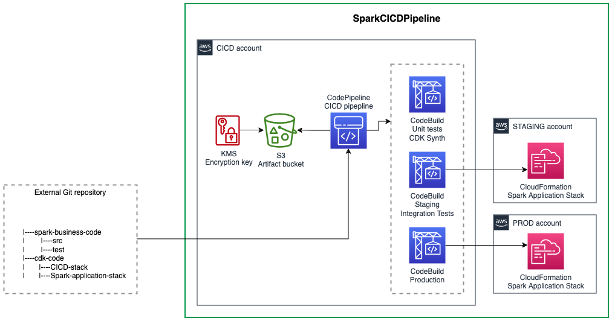

<!-- This file is generated, do not modify directly, update the README.md in framework/src/processing -->


import Tabs from '@theme/Tabs';
import TabItem from '@theme/TabItem';

Self-mutable CI/CD pipeline for a Spark application based on [Amazon EMR](https://aws.amazon.com/fr/emr/) runtime.

## Overview

The CI/CD pipeline uses [CDK Pipeline](https://docs.aws.amazon.com/cdk/v2/guide/cdk_pipeline.html) and provisions all the resources needed to implement a CI/CD pipeline for a Spark application on Amazon EMR, including:
* A CodePipeline triggered from the branch of the repository you defined in the `codeconnection` to process the CI/CD tasks
* A CodeBuild stage to build the CDK assets and run the Spark unit tests
* A Staging stage to deploy the application stack in the staging environment and run optional integration tests
* A Production stage to deploy the application stack in the production environment




## Cross-account deployment

You can use the same account or optionally use different accounts for CI/CD (where this construct is deployed), staging and production (where the application stack is deployed).
If using different accounts, bootstrap staging and production accounts with CDK and add a trust relationship from the CI/CD account:
```bash
cdk bootstrap --profile staging \
aws://<STAGING_ACCOUNT_ID>/<REGION> \
--trust <CICD_ACCOUNT_ID> \
--cloudformation-execution-policies "POLICY_ARN"
```
More information is available [here](https://docs.aws.amazon.com/cdk/v2/guide/cdk_pipeline.html#cdk_pipeline_bootstrap)

You need to also provide the accounts information in the cdk.json in the form of:
```json
{
  "staging": {
    "account": "<STAGING_ACCOUNT_ID>",
    "region": "<REGION>"
  },
  "prod": {
    "account": "<PROD_ACCOUNT_ID>",
    "region": "<REGION>"
  }
}
```

## User Defined Stages

To define multiple stages (which can also be deployed in different AWS accounts by following the bootstrap command in the previous section), configure the `cdk.json` file with the following:

```json
{
  "environments": [
    {
      "stageName": "<STAGE_NAME_1>",
      "account": "<STAGE_ACCOUNT_ID>",
      "region": "<REGION>",
      "triggerIntegTest": "<OPTIONAL_BOOLEAN_CAN_BE_OMMITTED>"
    },
    {
      "stageName": "<STAGE_NAME_2>",
      "account": "<STAGE_ACCOUNT_ID>",
      "region": "<REGION>",
      "triggerIntegTest": "<OPTIONAL_BOOLEAN_CAN_BE_OMMITTED>"
    },
    {
      "stageName": "<STAGE_NAME_3>",
      "account": "<STAGE_ACCOUNT_ID>",
      "region": "<REGION>",
      "triggerIntegTest": "<OPTIONAL_BOOLEAN_CAN_BE_OMMITTED>"
    }
  ]
}
```

## Defining a CDK Stack for the Spark application

The `SparkCICDPipeline` construct deploys an application stack, which contains your business logic, into staging and production environments.
The application stack is a standard CDK stack that you provide. It's expected to be passed via a factory class.

To do this, implement the `ApplicationStackFactory` and its `createStack()` method.
The `createStack()` method needs to return a `Stack` instance within the scope passed to the factory method.
This is used to create the application stack within the scope of the CDK Pipeline stage.

The `CICDStage` parameter is automatically passed by the CDK Pipeline via the factory method and allows you to customize the behavior of the Stack based on the stage.
For example, staging stage is used for integration tests so testing a processing job should be done via manually triggering it.
In opposition to production stage where the processing job could be automated on a regular basis.

Create your application stack using the factory pattern:

<Tabs>
  <TabItem value="typescript" label="TypeScript" default>

  ```typescript
export class EmrApplicationStackFactory extends dsf.utils.ApplicationStackFactory {
  createStack(scope: Construct, stage: dsf.utils.CICDStage): cdk.Stack {
    return new EmrApplicationStack(scope, 'EmrApplicationStack', stage);
  }
}

export class EmrApplicationStack extends cdk.Stack {
  constructor(scope: Construct, id: string, stage: dsf.utils.CICDStage) {
    super(scope, id);

    // DEFINE YOUR APPLICATION STACK HERE
    // USE STAGE PARAMETER TO CUSTOMIZE THE STACK BEHAVIOR

    if (stage == dsf.utils.CICDStage.PROD) {
      // prod only
    }
  }
}
  ```
  
  </TabItem>
  <TabItem value="python" label="Python">

  ```python
class EmrApplicationStackFactory(dsf.utils.ApplicationStackFactory):
    def create_stack(self, scope, stage):
        return EmrApplicationStack(scope, "EmrApplicationStack", stage)

class EmrApplicationStack(cdk.Stack):
    def __init__(self, scope, id, stage):
        super().__init__(scope, id)

        # DEFINE YOUR APPLICATION STACK HERE
        # USE STAGE PARAMETER TO CUSTOMIZE THE STACK BEHAVIOR

        if stage == dsf.utils.CICDStage.PROD:
            pass
  ```

  </TabItem>
</Tabs>

Use the factory to pass your application stack to the `SparkCICDPipeline` construct:

<Tabs>
  <TabItem value="typescript" label="TypeScript" default>

  ```typescript
export class CICDPipelineStack extends cdk.Stack {
  constructor(scope: Construct, id: string) {
    super(scope, id);
    new dsf.processing.SparkEmrCICDPipeline(this, 'SparkCICDPipeline', {
      sparkApplicationName: 'SparkTest',
      applicationStackFactory: new EmrApplicationStackFactory(),
      source: CodePipelineSource.connection('owner/weekly-job', 'mainline', {
        connectionArn: 'arn:aws:codeconnections:eu-west-1:123456789012:connection/aEXAMPLE-8aad-4d5d-8878-dfcab0bc441f'
      }),
    });
  }
}
  ```
  
  </TabItem>
  <TabItem value="python" label="Python">

  ```python
class CICDPipelineStack(cdk.Stack):
    def __init__(self, scope, id):
        super().__init__(scope, id)
        dsf.processing.SparkEmrCICDPipeline(self, "SparkCICDPipeline",
            spark_application_name="SparkTest",
            application_stack_factory=EmrApplicationStackFactory(),
            source=CodePipelineSource.connection("owner/weekly-job", "mainline",
                connection_arn="arn:aws:codeconnections:eu-west-1:123456789012:connection/aEXAMPLE-8aad-4d5d-8878-dfcab0bc441f"
            )
        )
  ```

  </TabItem>
</Tabs>

## Unit tests
The construct triggers the unit tests as part of the CI/CD process using the EMR docker image and a fail fast approach.
The unit tests are run during the first build step and the entire pipeline stops if the unit tests fail.

Units tests are expected to be run with `pytest` command after a `pip install .` is run from the Spark root folder configured via `sparkPath`.

In your Pytest script, use a Spark session with a local master and client mode as the unit tests run in a local EMR docker container:
```python
spark = (
        SparkSession.builder.master("local[1]")
        .appName("local-tests")
        .config("spark.submit.deployMode", "client")
        .config("spark.driver.bindAddress", "127.0.0.1")
        .getOrCreate()
    )
```

## Integration tests
You can optionally run integration tests as part of the CI/CD process using the AWS CLI in a bash script that return `0` exit code if success and `1` if failure.
The integration tests are triggered after the deployment of the application stack in the staging environment. 

You can run them via `integTestScript` path that should point to a bash script. For example:

```bash
root
|--spark
|    |--integ.sh
|--cdk
```

`integ.sh` is a standard bash script using the AWS CLI to validate the application stack. In the following script example, a Step Function from the application stack is triggered and the result of its execution should be successful:
```bash
#!/bin/bash
EXECUTION_ARN=$(aws stepfunctions start-execution --state-machine-arn $STEP_FUNCTION_ARN | jq -r '.executionArn')
while true
do
    STATUS=$(aws stepfunctions describe-execution --execution-arn $EXECUTION_ARN | jq -r '.status')
    if [ $STATUS = "SUCCEEDED" ]; then
        exit 0 
    elif [ $STATUS = "FAILED" ] || [ $STATUS = "TIMED_OUT" ] || [ $STATUS = "ABORTED" ]; then
        exit 1 
    else 
        sleep 10
        continue
    fi
done
```

To use resources that are deployed by the Application Stack like the Step Functions state machine ARN in the previous example:
1. Create a `CfnOutput` in your application stack with the value of your resource

<Tabs>
  <TabItem value="typescript" label="TypeScript" default>

  ```typescript
export class EmrApplicationStack extends cdk.Stack {
  constructor(scope: Construct, id: string, _stage: dsf.utils.CICDStage) {
    super(scope, id);

    const processingStateMachine = new StateMachine(this, 'ProcessingStateMachine', {
      // definition ...
    });

    new cdk.CfnOutput(this, 'ProcessingStateMachineArn', {
      value: processingStateMachine.stateMachineArn,
    });
  }
}
  ```
  
  </TabItem>
  <TabItem value="python" label="Python">

  ```python
class EmrApplicationStack(cdk.Stack):
    def __init__(self, scope, id, _stage):
        super().__init__(scope, id)

        processing_state_machine = StateMachine(self, "ProcessingStateMachine")

        cdk.CfnOutput(self, "ProcessingStateMachineArn",
            value=processing_state_machine.state_machine_arn
        )
  ```

  </TabItem>
</Tabs>

2. Pass an environment variable to the `SparkCICDPipeline` construct in the form of a key/value pair via `integTestEnv`:
 * Key is the name of the environment variable used in the script: `STEP_FUNCTION_ARN` in the script example above.
 * Value is the CloudFormation output name from the application stack: `ProcessingStateMachineArn` in the application stack example above.
 * Add permissions required to run the integration tests script. In this example, `states:StartExecution` and `states:DescribeExecution`.

<Tabs>
  <TabItem value="typescript" label="TypeScript" default>

  ```typescript
new dsf.processing.SparkEmrCICDPipeline(this, 'SparkCICDPipeline', {
  sparkApplicationName: 'SparkTest',
  applicationStackFactory: new EmrApplicationStackFactory(),
  integTestScript: 'spark/integ.sh',
  integTestEnv: {
    STEP_FUNCTION_ARN: 'ProcessingStateMachineArn',
  },
  integTestPermissions: [
    new PolicyStatement({
      actions: [
        'states:StartExecution',
        'states:DescribeExecution',
      ],
      resources: ['*'],
    }),
  ],
  source: CodePipelineSource.connection('owner/weekly-job', 'mainline', {
    connectionArn: 'arn:aws:codeconnections:eu-west-1:123456789012:connection/aEXAMPLE-8aad-4d5d-8878-dfcab0bc441f'
  })
});
  ```
  
  </TabItem>
  <TabItem value="python" label="Python">

  ```python
dsf.processing.SparkEmrCICDPipeline(self, "SparkCICDPipeline",
    spark_application_name="SparkTest",
    application_stack_factory=EmrApplicationStackFactory(),
    integ_test_script="spark/integ.sh",
    integ_test_env={
        "STEP_FUNCTION_ARN": "ProcessingStateMachineArn"
    },
    integ_test_permissions=[
        PolicyStatement(
            actions=["states:StartExecution", "states:DescribeExecution"
            ],
            resources=["*"]
        )
    ],
    source=CodePipelineSource.connection("owner/weekly-job", "mainline",
        connection_arn="arn:aws:codeconnections:eu-west-1:123456789012:connection/aEXAMPLE-8aad-4d5d-8878-dfcab0bc441f"
    )
)
  ```

  </TabItem>
</Tabs>


