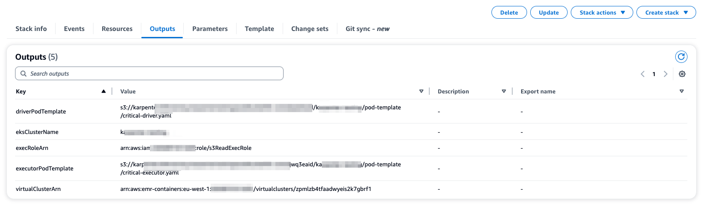

<!-- This file is generated, do not modify directly, update the README.md in framework/src/processing -->


import Tabs from '@theme/Tabs';
import TabItem from '@theme/TabItem';

An EMR on EKS runtime with preconfigured EKS cluster. 

## Overview

The constructs creates an EKS cluster, install the necessary controllers and enable it to be used by EMR on EKS service as described in this [documentation](https://docs.aws.amazon.com/emr/latest/EMR-on-EKS-DevelopmentGuide/setting-up-cluster-access.html). The following are the details of the components deployed.

 * An EKS cluster (VPC configuration can be customized)
 * A tooling nodegroup to run various tools including controllers
 * Kubernetes controlers: EBS CSI Driver, Karpenter, ALB Ingress Controller, cert-manager  
 * Optional default Kaprenter `NodePools` and `EC2NodeClass` as listed [here](https://github.com/awslabs/data-solutions-framework-on-aws/tree/main/framework/src/processing/lib/spark-runtime/emr-containers/resources/k8s/karpenter-provisioner-config).
 * An S3 bucket to store the pod templates for the `NodePools` created above.

Additionally, the construct exposes methods to facilitate the creation of EC2 capacity, Virtual Cluster and Execution roles. 

## Usage

The code snippet below shows a usage example of the `SparkEmrContainersRuntime` construct.

<Tabs>
  <TabItem value="typescript" label="TypeScript" default>

  ```typescript
class ExampleSparkEmrContainersStack extends cdk.Stack {
  constructor(scope: Construct, id: string) {
    super(scope, id);

    //Layer must be changed according to the Kubernetes version used
    const kubectlLayer = new KubectlV30Layer(this, 'kubectlLayer');

    const emrEksCluster = SparkEmrContainersRuntime.getOrCreate(this, {
      eksAdminRole: Role.fromRoleArn(this, 'EksAdminRole' , 'arn:aws:iam::12345678912:role/role-name-with-path'),
      publicAccessCIDRs: ['10.0.0.0/32'], // The list of public IP addresses from which the cluster can be accessible
      createEmrOnEksServiceLinkedRole: true, //if the the service linked role already exists set this to false
      kubectlLambdaLayer: kubectlLayer,
    });

    const s3Read = new PolicyDocument({
      statements: [new PolicyStatement({
        actions: [
          's3:GetObject',
        ],
        resources: [
          'arn:aws:s3:::aws-data-analytics-workshops',
          'arn:aws:s3:::aws-data-analytics-workshops/*'],
        })],
      });

      const s3ReadPolicy = new ManagedPolicy(this, 's3ReadPolicy', {
        document: s3Read,
      });

      const virtualCluster = emrEksCluster.addEmrVirtualCluster(this, {
        name: 'dailyjob',
        createNamespace: true,
        eksNamespace: 'dailyjobns',
      });

      const execRole = emrEksCluster.createExecutionRole(
        this,
        'ExecRole',
        s3ReadPolicy,
        'dailyjobns', // the namespace of the virtual cluster
        's3ReadExecRole'); //the IAM role name

        new cdk.CfnOutput(this, 'virtualClusterArn', {
          value: virtualCluster.attrArn,
        });

        new cdk.CfnOutput(this, 'execRoleArn', {
          value: execRole.roleArn,
        });

        //Driver pod template
        new cdk.CfnOutput(this, 'driverPodTemplate', {
          value: emrEksCluster.podTemplateS3LocationCriticalDriver!,
        });

        //Executor pod template
        new cdk.CfnOutput(this, 'executorPodTemplate', {
          value: emrEksCluster.podTemplateS3LocationCriticalExecutor!,
        });

      }
    }
  ```
  
  </TabItem>
  <TabItem value="python" label="Python">

  ```python
class ExampleSparkEmrContainersStack(cdk.Stack):
    def __init__(self, scope, id):
        super().__init__(scope, id)

        # Layer must be changed according to the Kubernetes version used
        kubectl_layer = KubectlV30Layer(self, "kubectlLayer")

        emr_eks_cluster = SparkEmrContainersRuntime.get_or_create(self,
            eks_admin_role=Role.from_role_arn(self, "EksAdminRole", "arn:aws:iam::12345678912:role/role-name-with-path"),
            public_access_cIDRs=["10.0.0.0/32"],  # The list of public IP addresses from which the cluster can be accessible
            create_emr_on_eks_service_linked_role=True,  # if the the service linked role already exists set this to false
            kubectl_lambda_layer=kubectl_layer
        )

        s3_read = PolicyDocument(
            statements=[PolicyStatement(
                actions=["s3:GetObject"
                ],
                resources=["arn:aws:s3:::aws-data-analytics-workshops", "arn:aws:s3:::aws-data-analytics-workshops/*"
                ]
            )]
        )

        s3_read_policy = ManagedPolicy(self, "s3ReadPolicy",
            document=s3_read
        )

        virtual_cluster = emr_eks_cluster.add_emr_virtual_cluster(self,
            name="dailyjob",
            create_namespace=True,
            eks_namespace="dailyjobns"
        )

        exec_role = emr_eks_cluster.create_execution_role(self, "ExecRole", s3_read_policy, "dailyjobns", "s3ReadExecRole") # the IAM role name

        cdk.CfnOutput(self, "virtualClusterArn",
            value=virtual_cluster.attr_arn
        )

        cdk.CfnOutput(self, "execRoleArn",
            value=exec_role.role_arn
        )

        # Driver pod template
        cdk.CfnOutput(self, "driverPodTemplate",
            value=emr_eks_cluster.pod_template_s3_location_critical_driver
        )

        # Executor pod template
        cdk.CfnOutput(self, "executorPodTemplate",
            value=emr_eks_cluster.pod_template_s3_location_critical_executor
        )
  ```

  </TabItem>
</Tabs>

The sceenshot below show how the cloudformation will look like once you deploy the example.



You can execute the following command to run a sample job with the infratructure deployed using SparkEmrContainerRuntime:

```sh
aws emr-containers start-job-run \
--virtual-cluster-id FROM-CFNOUTPUT-VIRTUAL_CLUSTER_ID \
--name spark-pi \
--execution-role-arn FROM-CFNOUTPUT-jOB_EXECUTION_ROLE_ARN \
--release-label emr-7.0.0-latest \
--job-driver '{
    "sparkSubmitJobDriver": {
        "entryPoint": "s3://aws-data-analytics-workshops/emr-eks-workshop/scripts/pi.py",
        "sparkSubmitParameters": "--conf spark.executor.instances=8 --conf spark.executor.memory=2G --conf spark.executor.cores=2 --conf spark.driver.cores=1 --conf spark.kubernetes.driver.podTemplateFile=FROM-CFNOUTPUT-DRIVER-POD-TEMPLATE --conf spark.kubernetes.executor.podTemplateFile=FROM-CFNOUTPUT-EXECUTOR-POD-TEMPLATE"
        }
    }'
```

:::warning IAM role requirements

Make sure the role used for running has the correct [IAM policy](https://docs.aws.amazon.com/service-authorization/latest/reference/list_amazonemroneksemrcontainers.html#amazonemroneksemrcontainers-actions-as-permissions) with `StartJobRun` permission to execute the job.

:::


### Isolating workloads on a shared cluster

With EMR on EKS you can leverage the same EKS cluster to run Spark jobs from multiple teams leveraging namespace segragation through the EMR virtual cluster. The `SparkEMRContainersRuntime` simplifies the creation of an EMR virtual cluster. 
The `addEmrVirtualCluster()` method enables the EKS cluster to be used by EMR on EKS through the creation EMR on EKS virtual cluster.
The method configures the right Kubernetes RBAC as described [here](https://docs.aws.amazon.com/emr/latest/EMR-on-EKS-DevelopmentGuide/setting-up-cluster-access.html). It can optionally create the namespace for you.

<Tabs>
  <TabItem value="typescript" label="TypeScript" default>

  ```typescript
    const virtualCluster = emrEksCluster.addEmrVirtualCluster(this, {
      name: 'dailyjob',
      createNamespace: true,
      eksNamespace: 'dailyjobns',
    });

    new cdk.CfnOutput(this, 'virtualClusterArn', {
      value: virtualCluster.attrArn,
    });
  ```
  
  </TabItem>
  <TabItem value="python" label="Python">

  ```python
virtual_cluster = emr_eks_cluster.add_emr_virtual_cluster(self,
    name="dailyjob",
    create_namespace=True,
    eks_namespace="dailyjobns"
)

cdk.CfnOutput(self, "virtualClusterArn",
    value=virtual_cluster.attr_arn
)
  ```

  </TabItem>
</Tabs>

### EC2 Capacity

The EC2 capacity to execute the jobs is defined with [Karpenter](https://karpenter.sh/docs/getting-started/) `NodePools` and `EC2NodeClass`. By default, the construct configure Karpenter `NodePools` and `EC2NodeClass` for 3 types of workloads:
 * Critical workloads
 * Shared workloads
 * Notebook workloads
You can opt out from their creation by setting the `default_nodes` to `False`. 

To run EMR on EKS jobs on this EC2 capacity, the construct creates [Pod templates](https://docs.aws.amazon.com/emr/latest/EMR-on-EKS-DevelopmentGuide/pod-templates.html) and uploads them to an S3 bucket (created by the construct). 
The pod template are provided for both the Spark driver and the Spark executors and for each of the workload types. They are configured to schedule the Spark pods on the corresponding Karpenter `NodePools` and `EC2NodeClass`. 
The pod templates locations are stored as class attribute and can be exposed via CloudFormation outputs. 
The usage example below shows how to provide these as CloudFormation output. The pod templates are referenced in your `spark configuration` that is part of your job defintion.

<Tabs>
  <TabItem value="typescript" label="TypeScript" default>

  ```typescript
    const emrEksCluster = SparkEmrContainersRuntime.getOrCreate(this, {
      eksAdminRole: Role.fromRoleArn(this, 'EksAdminRole' , 'arn:aws:iam::12345678912:role/role-name-with-path'),
      publicAccessCIDRs: ['10.0.0.0/32'], // The list of public IP addresses from which the cluster can be accessible
      createEmrOnEksServiceLinkedRole: true, //if the the service linked role already exists set this to false
      kubectlLambdaLayer: kubectlLayer,
      defaultNodes: true,
    });

    //Driver pod template for critical workloads
    new cdk.CfnOutput(this, 'driverPodTemplate', {
      value: emrEksCluster.podTemplateS3LocationCriticalDriver!,
    });

    //Executor pod template for critical workloads
    new cdk.CfnOutput(this, 'executorPodTemplate', {
      value: emrEksCluster.podTemplateS3LocationCriticalExecutor!,
    });
  ```
  
  </TabItem>
  <TabItem value="python" label="Python">

  ```python
emr_eks_cluster = SparkEmrContainersRuntime.get_or_create(self,
    eks_admin_role=Role.from_role_arn(self, "EksAdminRole", "arn:aws:iam::12345678912:role/role-name-with-path"),
    public_access_cIDRs=["10.0.0.0/32"],  # The list of public IP addresses from which the cluster can be accessible
    create_emr_on_eks_service_linked_role=True,  # if the the service linked role already exists set this to false
    kubectl_lambda_layer=kubectl_layer,
    default_nodes=True
)

# Driver pod template for critical workloads
cdk.CfnOutput(self, "driverPodTemplate",
    value=emr_eks_cluster.pod_template_s3_location_critical_driver
)

# Executor pod template for critical workloads
cdk.CfnOutput(self, "executorPodTemplate",
    value=emr_eks_cluster.pod_template_s3_location_critical_executor
)
  ```

  </TabItem>
</Tabs>

The construct also exposes the `addKarpenterNodePoolAndNodeClass()` method to define your own EC2 capacity. This method takes a YAML file as defined in [Karpenter](https://karpenter.sh/docs/getting-started/getting-started-with-karpenter/#5-create-nodepool) and apply it to the EKS cluster. You can consult an example [here](https://github.com/awslabs/data-solutions-framework-on-aws/blob/main/framework/src/processing/lib/spark-runtime/emr-containers/resources/k8s/karpenter-provisioner-config/v0.32.1/critical-provisioner.yml).


### Execution role

The execution role is the IAM role that is used by the Spark job to access AWS resources. For example, the job may need to access an S3 bucket that stores the source data or to which the job writes the data. The `createExecutionRole()` method simplifies the creation of an IAM role that can be used to execute a Spark job on the EKS cluster and in a specific EMR EKS virtual cluster namespace. The method attaches an IAM policy provided by the user and a policy to access the pod templates when using the default EC2 capacity.

<Tabs>
  <TabItem value="typescript" label="TypeScript" default>

  ```typescript
      emrEksCluster.addEmrVirtualCluster(this, {
        name: 'dailyjob',
        createNamespace: true,
        eksNamespace: 'dailyjobns',
      });

      const execRole = emrEksCluster.createExecutionRole(
        this,
        'ExecRole',
        s3ReadPolicy, // the IAM managed policy granting permissions required by the Spark job
        'dailyjobns', // the namespace of the virtual cluster
        's3ReadExecRole' //the IAM role name
        );

        new cdk.CfnOutput(this, 'execRoleArn', {
          value: execRole.roleArn,
        });
  ```
  
  </TabItem>
  <TabItem value="python" label="Python">

  ```python
emr_eks_cluster.add_emr_virtual_cluster(self,
    name="dailyjob",
    create_namespace=True,
    eks_namespace="dailyjobns"
)

exec_role = emr_eks_cluster.create_execution_role(self, "ExecRole", s3_read_policy, "dailyjobns", "s3ReadExecRole")

cdk.CfnOutput(self, "execRoleArn",
    value=exec_role.role_arn
)
  ```

  </TabItem>
</Tabs>


### Interactive endpoint

The interactive endpoint provides the capability for interactive clients like Amazon EMR Studio or a self-hosted Jupyter notebook to connect to Amazon EMR on EKS clusters to run interactive workloads. The interactive endpoint is backed by a Jupyter Enterprise Gateway that provides the remote kernel lifecycle management capability that interactive clients need.

<Tabs>
  <TabItem value="typescript" label="TypeScript" default>

  ```typescript
        const virtualCluster = emrEksCluster.addEmrVirtualCluster(this, {
            name: 'dailyjob',
            createNamespace: true,
            eksNamespace: 'dailyjobns',
        });

        const execRole = emrEksCluster.createExecutionRole(this, 'ExecRole', s3ReadPolicy, 'dailyjobns', 's3ReadExecRole');

        const interactiveSession = emrEksCluster.addInteractiveEndpoint(this, 'interactiveSession', {
           virtualClusterId: virtualCluster.attrId,
           managedEndpointName: 'interactiveSession',
           executionRole: execRole,
         });

        //Virtual Cluster ARN
        new cdk.CfnOutput(this, 'virtualClusterArn', {
            value: virtualCluster.attrArn,
        });

        //Interactive session ARN
        new cdk.CfnOutput(this, 'interactiveSessionArn', {
           value: interactiveSession.getAttString('arn'),
         });
  ```
  
  </TabItem>
  <TabItem value="python" label="Python">

  ```python
virtual_cluster = emr_eks_cluster.add_emr_virtual_cluster(self,
    name="dailyjob",
    create_namespace=True,
    eks_namespace="dailyjobns"
)

exec_role = emr_eks_cluster.create_execution_role(self, "ExecRole", s3_read_policy, "dailyjobns", "s3ReadExecRole")

interactive_session = emr_eks_cluster.add_interactive_endpoint(self, "interactiveSession",
    virtual_cluster_id=virtual_cluster.attr_id,
    managed_endpoint_name="interactiveSession",
    execution_role=exec_role
)

# Virtual Cluster ARN
cdk.CfnOutput(self, "virtualClusterArn",
    value=virtual_cluster.attr_arn
)

# Interactive session ARN
cdk.CfnOutput(self, "interactiveSessionArn",
    value=interactive_session.get_att_string("arn")
)
  ```

  </TabItem>
</Tabs>

### Grant Job Execution

The Grant Job Execution allow you to provide an IAM role the rights to start the execution of a job and monitor it in a given virtual cluster. The policy attached will be as follow.

```json
{
	"Version": "2012-10-17",
	"Statement": [
		{
			"Action": [
				"emr-containers:DescribeJobRun",
				"emr-containers:ListJobRuns"
			],
			"Resource": "arn:aws:emr-containers:REGION:ACCOUNT-ID:/virtualclusters/aaabbccmmm",
			"Effect": "Allow"
		},
		{
			"Condition": {
				"ArnEquals": {
					"emr-containers:ExecutionRoleArn": [
						"arn:aws:iam::ACCOUNT-ID:role/s3ReadExecRole"
					]
				}
			},
			"Action": "emr-containers:StartJobRun",
			"Resource": "arn:aws:emr-containers:REGION:ACCOUNT-ID:/virtualclusters/aaabbccmmm",
			"Effect": "Allow"
		},
		{
			"Action": "emr-containers:TagResource",
			"Resource": "arn:aws:emr-containers:REGION:ACCOUNT-ID:/virtualclusters/aaabbccmmm/jobruns/*",
			"Effect": "Allow"
		}
	]
}
```

<Tabs>
  <TabItem value="typescript" label="TypeScript" default>

  ```typescript
        // IAM role that is used to start the execution and monitor its state
        const startJobRole: IRole = Role.fromRoleName(this, 'StartJobRole', 'StartJobRole');

        SparkEmrContainersRuntime.grantStartJobExecution(startJobRole, [execRole.roleArn], virtualCluster.attrArn);
  ```
  
  </TabItem>
  <TabItem value="python" label="Python">

  ```python
# IAM role that is used to start the execution and monitor its state
start_job_role = Role.from_role_name(self, "StartJobRole", "StartJobRole")

SparkEmrContainersRuntime.grant_start_job_execution(start_job_role, [exec_role.role_arn], virtual_cluster.attr_arn)
  ```

  </TabItem>
</Tabs>

