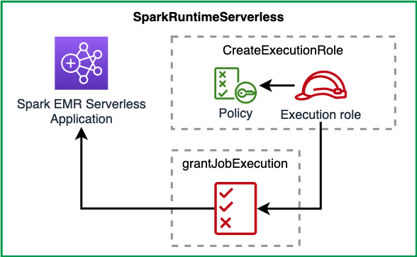

[//]: # (This file is generated, do not modify directly, update the README.md in framework/src/processing)
import Tabs from '@theme/Tabs';
import TabItem from '@theme/TabItem';

A [Spark EMR Serverless Application](https://docs.aws.amazon.com/emr/latest/EMR-Serverless-UserGuide/getting-started.html) with IAM roles and permissions helpers.

## Overview

The construct creates a Spark EMR Serverless Application, with the latest EMR runtime as the default runtime. You can change the runtime by passing your own as a `Resource property` to construct initializer. It also provides methods to create a principal or grant an existing principal (ie IAM Role or IAM User) with the permission to start a job on this EMR Serverless application.

The construct creates a default VPC that is used by EMR Serverless Application. The VPC has `10.0.0.0/16` CIDR range, and comes with an S3 VPC Endpoint Gateway attached to it. The construct also creates a security group for the EMR Serverless Application. You can override this by defining your own `NetworkConfiguration` as defined in the `Resource properties` of the construct initializer.

The construct has the following interfaces:

* A construct Initializer that takes an object as `Resource properties` to modify the default properties. The properties are defined in `SparkEmrServerlessRuntimeProps` interface.
* A method to create an execution role for EMR Serverless. The execution role is scoped down to the EMR Serverless Application ARN created by the construct.
* A method that takes an IAM role to call the `StartJobRun`, and monitors the status of the job.
  * The IAM policies attached to the provided IAM role is as [follow](https://github.com/awslabs/data-solutions-framework-on-aws/blob/c965202f48088f5ae51ce0e719cf92adefac94ac/framework/src/processing/spark-runtime/emr-serverless/spark-emr-runtime-serverless.ts#L117).
  * The role has a `PassRole` permission scoped as [follow](https://github.com/awslabs/data-solutions-framework-on-aws/blob/c965202f48088f5ae51ce0e719cf92adefac94ac/framework/src/processing/spark-runtime/emr-serverless/spark-emr-runtime-serverless.ts#L106).

The construct has the following attributes:

* applicationArn: EMR Serverless Application ARN
* applicationId: EMR Serverless Application ID
* vpc: VPC is created if none is provided
* emrApplicationSecurityGroup: security group created with VPC
* s3GatewayVpcEndpoint: S3 Gateway endpoint attached to VPC

The construct is depicted below:



## Usage

The code snippet below shows a usage example of the `SparkEmrServerlessRuntime` construct.

<Tabs>
  <TabItem value="typescript" label="TypeScript" default>

  ```typescript
class ExampleSparkEmrServerlessStack extends cdk.Stack {
    constructor(scope: Construct, id: string) {
        super(scope, id);

        const runtimeServerless = new dsf.processing.SparkEmrServerlessRuntime(this, 'SparkRuntimeServerless', {
            name: 'spark-serverless-demo',
        });

        const s3ReadPolicyDocument = new PolicyDocument({
            statements: [
                PolicyStatement.fromJson({
                    actions: ['s3:GetObject'],
                    resources: ['arn:aws:s3:::bucket_name'],
                }),
            ],
        });

        // The IAM role that will trigger the Job start and will monitor it
        const jobTrigger = new Role(this, 'EMRServerlessExecutionRole', {
            assumedBy: new ServicePrincipal('lambda.amazonaws.com'),
        });

        const executionRole = dsf.processing.SparkEmrServerlessRuntime.createExecutionRole(this, 'EmrServerlessExecutionRole', s3ReadPolicyDocument);

        runtimeServerless.grantStartExecution(jobTrigger, executionRole.roleArn);

        new cdk.CfnOutput(this, 'SparkRuntimeServerlessStackApplicationArn', {
            value: runtimeServerless.application.attrArn,
        });
    }
}
  ```
  
  ```mdx-code-block
  
  </TabItem>
  <TabItem value="python" label="Python">

  ```python
class ExampleSparkEmrServerlessStack(cdk.Stack):
    def __init__(self, scope, id):
        super().__init__(scope, id)

        runtime_serverless = dsf.processing.SparkEmrServerlessRuntime(self, "SparkRuntimeServerless",
            name="spark-serverless-demo"
        )

        s3_read_policy_document = PolicyDocument(
            statements=[
                PolicyStatement.from_json({
                    "actions": ["s3:GetObject"],
                    "resources": ["arn:aws:s3:::bucket_name"]
                })
            ]
        )

        # The IAM role that will trigger the Job start and will monitor it
        job_trigger = Role(self, "EMRServerlessExecutionRole",
            assumed_by=ServicePrincipal("lambda.amazonaws.com")
        )

        execution_role = dsf.processing.SparkEmrServerlessRuntime.create_execution_role(self, "EmrServerlessExecutionRole", s3_read_policy_document)

        runtime_serverless.grant_start_execution(job_trigger, execution_role.role_arn)

        cdk.CfnOutput(self, "SparkRuntimeServerlessStackApplicationArn",
            value=runtime_serverless.application.attr_arn
        )
  ```

  </TabItem>
</Tabs>


