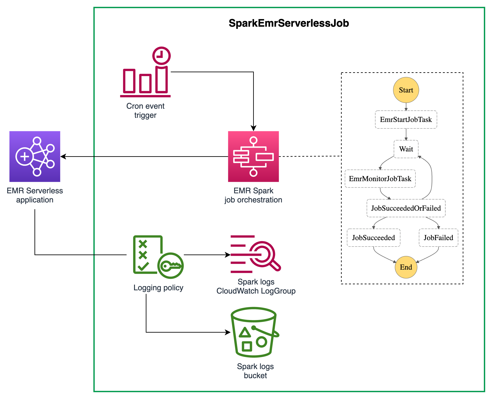

[//]: # (This file is generated, do not modify directly, update the README.md in framework/src/processing)
import Tabs from '@theme/Tabs';
import TabItem from '@theme/TabItem';

An [Amazon EMR Serverless](https://docs.aws.amazon.com/emr/latest/EMR-Serverless-UserGuide/getting-started.html) Spark job orchestrated through AWS Step Functions state machine.

## Overview

The construct creates an AWS Step Functions state machine that is used to submit a Spark job and orchestrate the lifecycle of the job. The construct leverages the [AWS SDK service integrations](https://docs.aws.amazon.com/step-functions/latest/dg/supported-services-awssdk.html) to submit the jobs. The state machine can take a cron expression to trigger the job at a given interval. The schema below shows the state machine:



## Usage

The example stack below shows how to use `EmrServerlessSparkJob` construct. The stack also contains a `SparkEmrServerlessRuntime` to show how to create an EMR Serverless Application and pass it as an argument to the `Spark job` and use it as a runtime for the job.

<Tabs>
  <TabItem value="typescript" label="TypeScript" default>

  ```typescript
class ExampleSparkJobEmrServerlessStack extends cdk.Stack {
  constructor(scope: Construct, id: string) {
    super(scope, id);
    const runtime = new dsf.processing.SparkEmrServerlessRuntime(this, 'SparkRuntime', {
      name: 'mySparkRuntime',
    });

    const s3ReadPolicy = new PolicyDocument({
      statements: [
        PolicyStatement.fromJson({
          actions: ['s3:GetObject'],
          resources: ['arn:aws:s3:::bucket_name', 'arn:aws:s3:::bucket_name/*'],
        }),
      ],
    });

    const executionRole = dsf.processing.SparkEmrServerlessRuntime.createExecutionRole(this, 'EmrServerlessExecutionRole', s3ReadPolicy);

    const nightJob = new dsf.processing.SparkEmrServerlessJob(this, 'SparkNightlyJob', {
      applicationId: runtime.application.attrApplicationId,
      name: 'nightly_job',
      executionRole: executionRole,
      executionTimeout: cdk.Duration.minutes(15),
      s3LogBucket: Bucket.fromBucketName(this, 'LogBucket', 'emr-job-logs-EXAMPLE'),
      s3LogPrefix: 'logs',
      sparkSubmitEntryPoint: 'local:///usr/lib/spark/examples/src/main/python/pi.py',
      sparkSubmitParameters: '--conf spark.executor.instances=2 --conf spark.executor.memory=2G --conf spark.driver.memory=2G --conf spark.executor.cores=4',
    });

    new CfnOutput(this, 'job-state-machine', {
      value: nightJob.stateMachine!.stateMachineArn,
    });
  }
}
  ```
  
  ```mdx-code-block
  
  </TabItem>
  <TabItem value="python" label="Python">

  ```python
class ExampleSparkJobEmrServerlessStack(cdk.Stack):
    def __init__(self, scope, id):
        super().__init__(scope, id)
        runtime = dsf.processing.SparkEmrServerlessRuntime(self, "SparkRuntime",
            name="mySparkRuntime"
        )

        s3_read_policy = PolicyDocument(
            statements=[
                PolicyStatement.from_json({
                    "actions": ["s3:GetObject"],
                    "resources": ["arn:aws:s3:::bucket_name", "arn:aws:s3:::bucket_name/*"]
                })
            ]
        )

        execution_role = dsf.processing.SparkEmrServerlessRuntime.create_execution_role(self, "EmrServerlessExecutionRole", s3_read_policy)

        night_job = dsf.processing.SparkEmrServerlessJob(self, "SparkNightlyJob",
            application_id=runtime.application.attr_application_id,
            name="nightly_job",
            execution_role=execution_role,
            execution_timeout=cdk.Duration.minutes(15),
            s3_log_bucket=Bucket.from_bucket_name(self, "LogBucket", "emr-job-logs-EXAMPLE"),
            s3_log_prefix="logs",
            spark_submit_entry_point="local:///usr/lib/spark/examples/src/main/python/pi.py",
            spark_submit_parameters="--conf spark.executor.instances=2 --conf spark.executor.memory=2G --conf spark.driver.memory=2G --conf spark.executor.cores=4"
        )

        CfnOutput(self, "job-state-machine",
            value=night_job.state_machine.state_machine_arn
        )
  ```

  </TabItem>
</Tabs>


