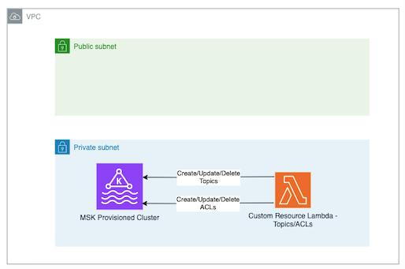
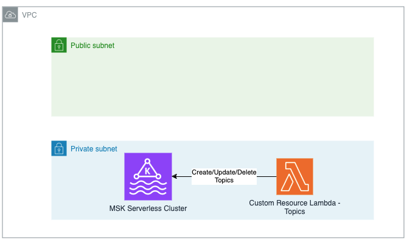

[//]: # (This file is generated, do not modify directly, update the README.md in framework/src/streaming)
import Tabs from '@theme/Tabs';
import TabItem from '@theme/TabItem';

An MSK Provisioned cluster with helpers to manage topics and IAM permissions

## Overview

The construct creates an MSK Serverless Cluster, with the latest Kafka version in MSK as default. You can change the dafaults by passing your own parameters as a Resource property to construct initializer. The construct support creating clusters with mTLS, IAM or both as authentication methods. There is also a method to manage topics and ACLs. Last, it also provides methods to grant an existing principal (ie IAM Role or IAM User or CN -Common Name-) with the permission to `produce` or `consume` from a kafka topic. The diagram below shows the high level architecture.



The construct can create a VPC on your behalf that is used to deploy MSK Provisioned cluser or you can provide your own VPC definition through the `vpcConfigs` property when you initialize the construct. The VPC that is created on your behalf has `10.0.0.0/16` CIDR range, and comes with an S3 VPC Endpoint Gateway attached to it. The construct also creates a security group for that is attached to the brokers.

### Construct cluster setup

The construct sets up a dedicated security group for Zookeeper as advised in the AWS [documentation](https://docs.aws.amazon.com/msk/latest/developerguide/zookeeper-security.html#zookeeper-security-group). When authentication is set to TLS, the construct apply ACLs on the provided principal in the props defined as `certificateDefinition`. This principal is used by the custom resource to manage ACL. Last, the construct applies MSK configuration, setting `allow.everyone.if.no.acl.found` to `false`.

### Interacting with cluster

The construct has the following interfaces, you will usage examples in the new sections:

    *  setTopic: Perform create, update, and delete operations on Topics
    *  setACL: Perform create, update, and delete operations on ACL
    *  grantProduce: Attach an IAM policy to a principal to write to a topic 
    *  grantConsume: Attach an IAM policy to a principal to read from a topic

Below you can find an example of creating an MSK Provisioned configuration with the default options.

<Tabs>
  <TabItem value="typescript" label="TypeScript" default>

  ```typescript
const msk = new MskProvisioned(stack, 'cluster', {
  clusterName: 'my-cluster',
  vpcSubnets: { subnetType: SubnetType.PRIVATE_WITH_EGRESS },
  numberOfBrokerNodes: 2,
  mskBrokerinstanceType: MskBrokerInstanceType.KAFKA_M5_LARGE,
  kafkaVersion: KafkaVersion.V3_4_0,
  removalPolicy: cdk.RemovalPolicy.DESTROY,
  kafkaClientLogLevel: KafkaClientLogLevel.DEBUG,
});
  ```
  
  ```mdx-code-block
  
  </TabItem>
  <TabItem value="python" label="Python">

  ```python
msk = MskProvisioned(stack, "cluster",
    cluster_name="my-cluster",
    vpc_subnets=cdk.aws_ec2.SubnetSelection(subnet_type=SubnetType.PRIVATE_WITH_EGRESS),
    number_of_broker_nodes=2,
    msk_brokerinstance_type=MskBrokerInstanceType.KAFKA_M5_LARGE,
    kafka_version=KafkaVersion.V3_4_0,
    removal_policy=cdk.RemovalPolicy.DESTROY,
    kafka_client_log_level=KafkaClientLogLevel.DEBUG
)
  ```

  </TabItem>
</Tabs>


## Usage

### Bring Your Own VPC

The construct allows you to provide your own VPC that was created outside the CDK Stack. Below you will find an example usage. 


<Tabs>
  <TabItem value="typescript" label="TypeScript" default>

  ```typescript
let vpc = Vpc.fromVpcAttributes(stack, 'vpc', {
    vpcId: 'vpc-1111111111',
    vpcCidrBlock: '10.0.0.0/16',
    availabilityZones: ['eu-west-1a', 'eu-west-1b'],
    publicSubnetIds: ['subnet-111111111', 'subnet-11111111'],
    privateSubnetIds: ['subnet-11111111', 'subnet-1111111'],
});

const msk = new MskProvisioned(stack, 'cluster', {
    vpc: vpc,
    clusterName: 'my-cluster',
    vpcSubnets: { subnetType: SubnetType.PRIVATE_WITH_EGRESS },
    numberOfBrokerNodes: 2,
    mskBrokerinstanceType: MskBrokerInstanceType.KAFKA_M5_LARGE,
    kafkaVersion: KafkaVersion.V3_4_0,
    removalPolicy: cdk.RemovalPolicy.DESTROY,
    kafkaClientLogLevel: KafkaClientLogLevel.DEBUG,
});

new cdk.CfnOutput(stack, 'mskArn', {
    value: msk.cluster.attrArn,
});
  ```
  
  ```mdx-code-block
  
  </TabItem>
  <TabItem value="python" label="Python">

  ```python
vpc = Vpc.from_vpc_attributes(stack, "vpc",
    vpc_id="vpc-1111111111",
    vpc_cidr_block="10.0.0.0/16",
    availability_zones=["eu-west-1a", "eu-west-1b"],
    public_subnet_ids=["subnet-111111111", "subnet-11111111"],
    private_subnet_ids=["subnet-11111111", "subnet-1111111"]
)

msk = MskProvisioned(stack, "cluster",
    vpc=vpc,
    cluster_name="my-cluster",
    vpc_subnets=cdk.aws_ec2.SubnetSelection(subnet_type=SubnetType.PRIVATE_WITH_EGRESS),
    number_of_broker_nodes=2,
    msk_brokerinstance_type=MskBrokerInstanceType.KAFKA_M5_LARGE,
    kafka_version=KafkaVersion.V3_4_0,
    removal_policy=cdk.RemovalPolicy.DESTROY,
    kafka_client_log_level=KafkaClientLogLevel.DEBUG
)

cdk.CfnOutput(stack, "mskArn",
    value=msk.cluster.attr_arn
)
  ```

  </TabItem>
</Tabs>


### Create a cluster with mTLS authentication

The construct allows you to provide create a cluster with mTLS, below is a code snippet showing the configuration. Below you will find an example usage.

When using MSK with mTLS the constructs requires a principal that is assigned to the custom resources that manage ACLs and Topics. The certificate and private key are expected to be in a secret managed by [AWS Secrets Manager](https://docs.aws.amazon.com/secretsmanager/latest/userguide/intro.html). The secret needs to be in the format defined below and stored a `JSON Key/value` and not `Plaintext` in the Secret. The construct grants the lambda that supports the Custom Resource read access to the secret as an `Identity based policy`.

```json
    {
      key : "PRIVATE-KEY",
      cert : "CERTIFICATE"
    }
```

[example msk provisioned bring your own vpc](./examples/msk-provisioned-create-cluster-mtls.lit.ts)
<Tabs>
  <TabItem value="typescript" label="TypeScript" default>

  ```typescript
let certificateAuthority = CertificateAuthority.fromCertificateAuthorityArn(
    stack, 'certificateAuthority',
    'arn:aws:acm-pca:eu-west-1:123456789012:certificate-authority/aaaaaaaa-bbbb-454a-cccc-b454877f0d1b');

  const msk = new MskProvisioned(stack, 'cluster', {
    vpcSubnets: { subnetType: SubnetType.PRIVATE_WITH_EGRESS },
    numberOfBrokerNodes: 4,
    mskBrokerinstanceType: MskBrokerInstanceType.KAFKA_M7G_LARGE,
    kafkaVersion: KafkaVersion.V3_4_0,
    clientAuthentication: ClientAuthentication.saslTls(
      {
        iam: true,
        certificateAuthorities: [certificateAuthority],
      },
    ),
    removalPolicy: cdk.RemovalPolicy.DESTROY,
    certificateDefinition: {
      adminPrincipal: 'User:CN=Admin',
      aclAdminPrincipal: 'User:CN=aclAdmin',
      secretCertificate: Secret.fromSecretCompleteArn(stack, 'secret', 'arn:aws:secretsmanager:eu-west-1:123456789012:secret:dsf/mskCert-3UhUJJ'),
    },
    allowEveryoneIfNoAclFound: false,
  });
  ```
  
  ```mdx-code-block
  
  </TabItem>
  <TabItem value="python" label="Python">

  ```python
certificate_authority = CertificateAuthority.from_certificate_authority_arn(stack, "certificateAuthority", "arn:aws:acm-pca:eu-west-1:123456789012:certificate-authority/aaaaaaaa-bbbb-454a-cccc-b454877f0d1b")

msk = MskProvisioned(stack, "cluster",
    vpc_subnets=cdk.aws_ec2.SubnetSelection(subnet_type=SubnetType.PRIVATE_WITH_EGRESS),
    number_of_broker_nodes=4,
    msk_brokerinstance_type=MskBrokerInstanceType.KAFKA_M7G_LARGE,
    kafka_version=KafkaVersion.V3_4_0,
    client_authentication=ClientAuthentication.sasl_tls(
        iam=True,
        certificate_authorities=[certificate_authority]
    ),
    removal_policy=cdk.RemovalPolicy.DESTROY,
    certificate_definition=AclAdminProps(
        admin_principal="User:CN=Admin",
        acl_admin_principal="User:CN=aclAdmin",
        secret_certificate=Secret.from_secret_complete_arn(stack, "secret", "arn:aws:secretsmanager:eu-west-1:123456789012:secret:dsf/mskCert-3UhUJJ")
    ),
    allow_everyone_if_no_acl_found=False
)
  ```

  </TabItem>
</Tabs>


This method allows you to create, update or delete an ACL. Its backend uses [kafkajs](https://kafka.js.org/).
The topic is defined by the property type called `MskTopic`. Below you can see the definition of the ACL as well as a usage. 

```json
{
    topic: <String>,
    numPartitions: <Number>,     // default: -1 (uses broker `num.partitions` configuration)
    replicationFactor: <Number>, // default: -1 (uses broker `default.replication.factor` configuration)
    replicaAssignment: <Array>,  // Example: [{ partition: 0, replicas: [0,1,2] }] - default: []
    configEntries: <Array>       // Example: [{ name: 'cleanup.policy', value: 'compact' }] - default: []
}
```

Dependeding on the authentication type that is set in the cluster, you need to put the right parameter in authentication, for mTLS use `Authentitcation.MTLS` and for IAM use `Authentitcation.IAM`. The example below uses IAM as authentication.

[example msk provisiond setTopic](./examples/msk-provisioned-set-topic.lit.ts)
<Tabs>
  <TabItem value="typescript" label="TypeScript" default>

  ```typescript
msk.setTopic(stack, 'topic1',
  Authentitcation.IAM, {
    topic: 'topic1',
    numPartitions: 3,
    replicationFactor: 1,
  }, cdk.RemovalPolicy.DESTROY, false, 1500);
  ```
  
  ```mdx-code-block
  
  </TabItem>
  <TabItem value="python" label="Python">

  ```python
msk.set_topic(stack, "topic1", Authentitcation.IAM, MskTopic(
    topic="topic1",
    num_partitions=3,
    replication_factor=1
), cdk.RemovalPolicy.DESTROY, False, 1500)
  ```

  </TabItem>
</Tabs>


This method allows you to create, update or delete a topic. Its backend uses [kafkajs](https://kafka.js.org/).
The topic is defined by the property type called `MskACL`. This method should be used only when the cluster authentication is set to `mTLS`. Below you can see the definition of the topic as well as an example of use.

```json
{
    resourceType: <AclResourceTypes>,
    resourceName: <String>,
    resourcePatternType: <ResourcePatternTypes>,
    principal: <String>,
    host: <String>,
    operation: <AclOperationTypes>,
    permissionType: <AclPermissionTypes>,
}
```

[example msk provisiond setACL](./examples/msk-provisioned-set-acl.lit.ts)
<Tabs>
  <TabItem value="typescript" label="TypeScript" default>

  ```typescript
msk.setAcl(stack, 'acl', {
    resourceType: AclResourceTypes.TOPIC,
    resourceName: 'topic-1',
    resourcePatternType: ResourcePatternTypes.LITERAL,
    principal: 'User:Cn=Bar',
    host: '*',
    operation: AclOperationTypes.CREATE,
    permissionType: AclPermissionTypes.ALLOW,
  },
  cdk.RemovalPolicy.DESTROY);
  ```
  
  ```mdx-code-block
  
  </TabItem>
  <TabItem value="python" label="Python">

  ```python
msk.set_acl(stack, "acl", Acl(
    resource_type=AclResourceTypes.TOPIC,
    resource_name="topic-1",
    resource_pattern_type=ResourcePatternTypes.LITERAL,
    principal="User:Cn=Bar",
    host="*",
    operation=AclOperationTypes.CREATE,
    permission_type=AclPermissionTypes.ALLOW
), cdk.RemovalPolicy.DESTROY)
  ```

  </TabItem>
</Tabs>


This method allows to grant a `Principal` the rights to write to a kafka topic.
In case of IAM authentication the method attachs an IAM policy as defined in the [AWS documentation](https://docs.aws.amazon.com/msk/latest/developerguide/iam-access-control.html#iam-access-control-use-cases) scoped only to the topic provided. For mTLS authentication, the method apply an ACL for the provided `Common Name` that allows it to write to the topic. 


[example msk provisioned grantProduce](./examples/msk-provisioned-grant-produce.lit.ts)
<Tabs>
  <TabItem value="typescript" label="TypeScript" default>

  ```typescript
msk.grantProduce('consume', 'foo', Authentitcation.MTLS, 'User:Cn=MyUser');
  ```
  
  ```mdx-code-block
  
  </TabItem>
  <TabItem value="python" label="Python">

  ```python
msk.grant_produce("consume", "foo", Authentitcation.MTLS, "User:Cn=MyUser")
  ```

  </TabItem>
</Tabs>

This method allows to grant a `Principal` the rights to read to a kafka topic.
In case of IAM authentication the method attachs an IAM policy as defined in the [AWS documentation](https://docs.aws.amazon.com/msk/latest/developerguide/iam-access-control.html#iam-access-control-use-cases) scoped only to the topic provided. For mTLS authentication, the method apply an ACL for the provided `Common Name` that allows it to read from the topic.

[example msk provisioned grantConsume](./examples/msk-provisioned-grant-consume.lit.ts)
<Tabs>
  <TabItem value="typescript" label="TypeScript" default>

  ```typescript
msk.grantConsume('consume', 'foo', Authentitcation.MTLS, 'User:Cn=MyUser');
  ```
  
  ```mdx-code-block
  
  </TabItem>
  <TabItem value="python" label="Python">

  ```python
msk.grant_consume("consume", "foo", Authentitcation.MTLS, "User:Cn=MyUser")
  ```

  </TabItem>
</Tabs>

# MSK Serverless

An MSK Serverless cluster with helpers to manage topics and IAM permissions. 

## Overview

The construct creates an MSK Serverless Cluster, with the latest Kafka version in MSK as default. You can change the dafaults by passing your own parameters as a Resource property to construct initializer. There is also a method to create topics. Last, it also provides methods to grant an existing principal (ie IAM Role or IAM User) with the permission to `produce` or `consume` from a kafka topic. The diagram below shows the high level architecture.




The construct can create a VPC on your behalf that is used to deploy MSK Serverless cluser or you can provide your own VPC definition through the `vpcConfigs` property when you initialize the construct. The VPC that is created on your behalf has `10.0.0.0/16` CIDR range, and comes with an S3 VPC Endpoint Gateway attached to it. The construct also creates a security group for that is attached to the brokers.

The construct has the following interfaces, you will usage examples in the new sections: 
    *  setTopic: Perform create, update, and delete operations on Topics
    *  grantProduce: Attach an IAM policy to a principal to write to a topic 
    *  grantConsume: Attach an IAM policy to a principal to read from a topic

Below you can find an example of creating an MSK Serverless configuration with the default options.

[example msk serverless default](./examples/msk-serverless-default.lit.ts)
<Tabs>
  <TabItem value="typescript" label="TypeScript" default>

  ```typescript
const msk = new MskServerless(stack, 'cluster');

new cdk.CfnOutput(stack, 'mskArn', {
  value: msk.cluster.attrArn,
});
  ```
  
  ```mdx-code-block
  
  </TabItem>
  <TabItem value="python" label="Python">

  ```python
msk = MskServerless(stack, "cluster")

cdk.CfnOutput(stack, "mskArn",
    value=msk.cluster.attr_arn
)
  ```

  </TabItem>
</Tabs>

## Usage

### Bring Your Own VPC

The construct allows you to provide your own VPC that was created outside the CDK Stack. Below you will find an example usage. 


[example msk serverless bring your own vpc](./examples/msk-serverless-bring-vpc.lit.ts)
<Tabs>
  <TabItem value="typescript" label="TypeScript" default>

  ```typescript
let vpc = Vpc.fromVpcAttributes(stack, 'vpc', {
    vpcId: 'vpc-1111111111',
    vpcCidrBlock: '10.0.0.0/16',
    availabilityZones: ['eu-west-1a', 'eu-west-1b'],
    publicSubnetIds: ['subnet-111111111', 'subnet-11111111'],
    privateSubnetIds: ['subnet-11111111', 'subnet-1111111'],
});

const msk = new MskServerless(stack, 'cluster', {
    clusterName: 'msk-byov',
    vpcConfigs: [
      {
        subnetIds: vpc.privateSubnets.map((s) => s.subnetId),
        securityGroups: [SecurityGroup.fromLookupByName(stack, 'brokerSecurityGroup', 'broker-sg', vpc).securityGroupId],
      },
    ],
    vpc: vpc,
  });

new cdk.CfnOutput(stack, 'mskArn', {
  value: msk.cluster.attrArn,
});
  ```
  
  ```mdx-code-block
  
  </TabItem>
  <TabItem value="python" label="Python">

  ```python
vpc = Vpc.from_vpc_attributes(stack, "vpc",
    vpc_id="vpc-1111111111",
    vpc_cidr_block="10.0.0.0/16",
    availability_zones=["eu-west-1a", "eu-west-1b"],
    public_subnet_ids=["subnet-111111111", "subnet-11111111"],
    private_subnet_ids=["subnet-11111111", "subnet-1111111"]
)

msk = MskServerless(stack, "cluster",
    cluster_name="msk-byov",
    vpc_configs=[cdk.aws_msk.CfnServerlessCluster.VpcConfigProperty(
        subnet_ids=vpc.private_subnets.map((s) => s.subnetId),
        security_groups=[SecurityGroup.from_lookup_by_name(stack, "brokerSecurityGroup", "broker-sg", vpc).security_group_id]
    )
    ],
    vpc=vpc
)

cdk.CfnOutput(stack, "mskArn",
    value=msk.cluster.attr_arn
)
  ```

  </TabItem>
</Tabs>


This method allows you to create, update or delete a topic. Its backend uses [kafkajs](https://kafka.js.org/).
The topic is defined by the property type called `MskTopic`. Below you can see the definition of the topic as well as an example of use.

```json
{
    topic: <String>,
    numPartitions: <Number>,     // default: -1 (uses broker `num.partitions` configuration)
    replicationFactor: <Number>, // default: -1 (uses broker `default.replication.factor` configuration)
    configEntries: <Array>       // Example: [{ name: 'cleanup.policy', value: 'compact' }] - default: []
}
```

[example msk serverless default](./examples/msk-serverless-set-topic.lit.ts)
<Tabs>
  <TabItem value="typescript" label="TypeScript" default>

  ```typescript
let topic: MskTopic =  {
  topic: 'topic1',
  numPartitions: 3,
  replicationFactor: 1,
}

msk.addTopic(stack, 'topic1', topic, cdk.RemovalPolicy.DESTROY, false, 1500);
  ```
  
  ```mdx-code-block
  
  </TabItem>
  <TabItem value="python" label="Python">

  ```python
topic = MskTopic(
    topic="topic1",
    num_partitions=3,
    replication_factor=1
)

msk.add_topic(stack, "topic1", topic, cdk.RemovalPolicy.DESTROY, False, 1500)
  ```

  </TabItem>
</Tabs>


This method allows to grant a `Principal` the rights to write to a kafka topic.
The method attachs an IAM policy as defined in the [AWS documentation](https://docs.aws.amazon.com/msk/latest/developerguide/iam-access-control.html#iam-access-control-use-cases) scoped only to the topic provided.


[example msk serverless grantProduce](./examples/msk-serverless-grant-produce.lit.ts)
<Tabs>
  <TabItem value="typescript" label="TypeScript" default>

  ```typescript
let iamRole = Role.fromRoleName(stack, 'role', 'role');

msk.grantProduce('topic1',iamRole);
  ```
  
  ```mdx-code-block
  
  </TabItem>
  <TabItem value="python" label="Python">

  ```python
iam_role = Role.from_role_name(stack, "role", "role")

msk.grant_produce("topic1", iam_role)
  ```

  </TabItem>
</Tabs>

This method allows to grant a `Principal` the rights to read to a kafka topic.
The method attachs an IAM policy as defined in the [AWS documentation](https://docs.aws.amazon.com/msk/latest/developerguide/iam-access-control.html#iam-access-control-use-cases) scoped only to the topic provided.

[example msk serverless grantProduce](./examples/msk-serverless-grant-consume.lit.ts)
<Tabs>
  <TabItem value="typescript" label="TypeScript" default>

  ```typescript
let iamRole = Role.fromRoleName(stack, 'role', 'role');

msk.grantConsume('topic1',iamRole);
  ```
  
  ```mdx-code-block
  
  </TabItem>
  <TabItem value="python" label="Python">

  ```python
iam_role = Role.from_role_name(stack, "role", "role")

msk.grant_consume("topic1", iam_role)
  ```

  </TabItem>
</Tabs>

# Kafka Api - Bring your own cluster

A construct to support bring your own cluster and perform Create/Update/Delete operations for ACLs and Topics. The constructs support both MSK Serverless and MSK Provisioned. 

## Overview

The construct leverages the [CDK Provider Framework](https://docs.aws.amazon.com/cdk/api/v2/docs/aws-cdk-lib.custom_resources-readme.html#provider-framework) to deploy a custom resource to manage `topics`, and in case of `mTLS` authentication deploys also a custom resource to manage `ACLs`.

When using MSK with mTLS the constructs requires a principal that is assigned to the custom resources that manage ACLs and Topics. The certificate and private key are expected to be in a secret managed by [AWS Secrets Manager](https://docs.aws.amazon.com/secretsmanager/latest/userguide/intro.html). The secret needs to be in the format defined below and stored a `JSON Key/value` and not `Plaintext` in the Secret. The construct grants the lambda that supports the Custom Resource read access to the secret as an `Identity based policy`.

```json
    {
      key : "PRIVATE-KEY",
      cert : "CERTIFICATE"
    }
```

[example kafka api](./examples/kafka-api-default.lit.ts)
<Tabs>
  <TabItem value="typescript" label="TypeScript" default>

  ```typescript
  let vpc = Vpc.fromVpcAttributes(stack, 'vpc', {
      vpcId: 'vpc-1111111111',
      vpcCidrBlock: '10.0.0.0/16',
      availabilityZones: ['eu-west-1a', 'eu-west-1b'],
      publicSubnetIds: ['subnet-111111111', 'subnet-11111111'],
      privateSubnetIds: ['subnet-11111111', 'subnet-1111111'],
  });


  const kafkaApi = new KafkaApi(stack, 'kafkaApi', {
      vpc: vpc,
      clusterName: 'byo-msk',
      clusterArn: 'arn:aws:kafka:eu-west-1:12345678912:cluster/byo-msk/dummy-5cf3-42d5-aece-dummmy-2',
      brokerSecurityGroup: SecurityGroup.fromSecurityGroupId(stack, 'brokerSecurityGroup', 'sg-98237412hsa'),
      certficateSecret: secret,
      clientAuthentication: ClientAuthentication.saslTls({
          iam: true,
          certificateAuthorities: [certificateAuthority],
        },),
      kafkaClientLogLevel: KafkaClientLogLevel.DEBUG,
  });


  kafkaApi.setAcl(stack, 'acl', {
    resourceType: AclResourceTypes.TOPIC,
    resourceName: 'topic-1',
    resourcePatternType: ResourcePatternTypes.LITERAL,
    principal: 'User:Cn=Toto',
    host: '*',
    operation: AclOperationTypes.CREATE,
    permissionType: AclPermissionTypes.ALLOW,
  },
  cdk.RemovalPolicy.DESTROY);
  ```
  
  ```mdx-code-block
  
  </TabItem>
  <TabItem value="python" label="Python">

  ```python
vpc = Vpc.from_vpc_attributes(stack, "vpc",
    vpc_id="vpc-1111111111",
    vpc_cidr_block="10.0.0.0/16",
    availability_zones=["eu-west-1a", "eu-west-1b"],
    public_subnet_ids=["subnet-111111111", "subnet-11111111"],
    private_subnet_ids=["subnet-11111111", "subnet-1111111"]
)

kafka_api = KafkaApi(stack, "kafkaApi",
    vpc=vpc,
    cluster_name="byo-msk",
    cluster_arn="arn:aws:kafka:eu-west-1:12345678912:cluster/byo-msk/dummy-5cf3-42d5-aece-dummmy-2",
    broker_security_group=SecurityGroup.from_security_group_id(stack, "brokerSecurityGroup", "sg-98237412hsa"),
    certficate_secret=secret,
    client_authentication=ClientAuthentication.sasl_tls(
        iam=True,
        certificate_authorities=[certificate_authority]
    ),
    kafka_client_log_level=KafkaClientLogLevel.DEBUG
)

kafka_api.set_acl(stack, "acl", Acl(
    resource_type=AclResourceTypes.TOPIC,
    resource_name="topic-1",
    resource_pattern_type=ResourcePatternTypes.LITERAL,
    principal="User:Cn=Toto",
    host="*",
    operation=AclOperationTypes.CREATE,
    permission_type=AclPermissionTypes.ALLOW
), cdk.RemovalPolicy.DESTROY)
  ```

  </TabItem>
</Tabs>

