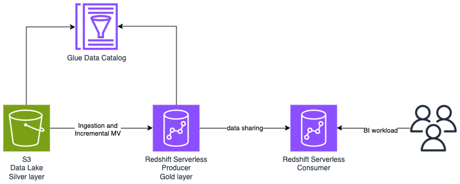

# Redshift Data Warehouse

Build a serverless data warehouse for runnnig large scale BI workloads on top of the data lake.

In this example, we will be using DSF on AWS to quickly build an end-to-end data warehouse. The Data Warehouse represents the gold layer of the Data of the data platform with data prepared for BI workloads. Gold layer in the Data Warehouse is processed from silver layer in the Data Lake via incremental materialized view. 

This example demonstrate a Database As Code approach where database and tables definitions are versioned in the infrastructure as code. The AWS CDK application using the DSF on AWS contains a single stack which provisions the Data Lake, data catalog, the Redshift Serverless and the DDL/DML to configure Redshift via the following constructs:
   * [`DataLakeStorage`](../constructs/library/02-Storage/03-data-lake-storage.mdx)
   * [`DataLaekCatalog](../constructs/library/04-Governance/02-data-lake-catalog.mdx)
   * [`RedshiftServerlessNamespace`](../constructs/library/05-Consumption/01-redshift-serverless-namespace.mdx)
   * [`RedshiftServerlessWorkgroup`](../constructs/library/05-Consumption/02-redshift-serverless-workgroup.mdx)
  

**This is what we will build in minutes and less than one hundred lines of codes!** Starting from scratch would require days and thousands of lines of code.

## Deployment guide

You can follow the [deployment guide](https://github.com/awslabs/data-solutions-framework-on-aws/tree/main/examples/redshift-data-warehouse) from DSF on AWS GitHub repo to deploy the solution.