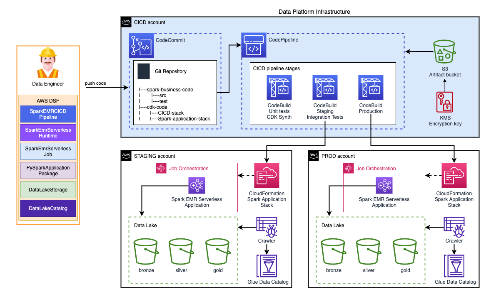

# Spark Data Lake

Build a data lake, process data with Spark and query the results with SQL.

This example demonstrates the benefits of reusing DSF on AWS components to remove undifferentiated infrastructure setup and maintenance tasks from data engineers so they can focus on business use cases and extracting value from data.

In this example, we will be using DSF on AWS to quickly build an end-to-end solution to store and process the data. The solution is production-ready, with local development compatiblity and a multi-environment CICD pipeline (staging, production) for deployment. 

We are using a self-contained application where developers can manage both business code (Spark code in `./spark` folder), and the infrastructure code (AWS CDK code in `./infra` folder).

The business code is a simple **PySpark** application packaged in a common Python project following the [best practices](https://packaging.python.org/en/latest/tutorials/packaging-projects/):
 * A `pyproject.toml` file is used to install internal (packages defined in the code structure) and external dependencies (libraries from PyPi).
 * An `src` folder containing business code organized in Python packages (`__init__.py` files).
 * A `test` folder containing the unit tests run via `pytest .` command from the root folder of the Spark project. You can use the [EMR Vscode toolkit](https://marketplace.visualstudio.com/items?itemName=AmazonEMR.emr-tools) to locally test the application on an EMR local runtime.

The infrastructure code is an AWS CDK application using the DSF on AWS library to create the required resources. It contains 2 CDK stacks:
 * An **application stack** which provisions the Data Lake, data catalog, and the Spark runtime resources via the following constructs:
   * [`DataLakeStorage`](../constructs/library/02-Storage/03-data-lake-storage.mdx)
   * [`DataLakeCatalog`](../constructs/library/04-Governance/02-data-lake-catalog.mdx)
   * [`SparkEmrServerlessRuntime`](../constructs/library/03-Processing/01-spark-emr-serverless-runtime.mdx)
   * [`SparkEmrServerlessJob`](../constructs/library/03-Processing/03-spark-emr-serverless-job.mdx)
   * [`PySparkApplicationPackage`](../constructs/library/03-Processing/04-pyspark-application-package.mdx)
 * A **CICD stack** which provisions a CICD Pipeline to manage the application development lifecycle via the following constructs:
   * [`SparkEmrCICDPipeline`](../constructs/library/03-Processing/05-spark-cicd-pipeline.mdx)
   * [`ApplicationStackFactory`](../constructs/library/03-Processing/05-spark-cicd-pipeline.mdx#defining-a-cdk-stack-for-the-spark-application)

**This is what we will build in minutes and less than one hundred lines of codes!** Starting from scratch would require days and thousands of lines of code.

## Benefits for data engineers

Here is a list of features implemented in this example (via DSF constructs) that simplify the job of the data engineer:
 - All the code is maintained in a single repository (business code, infrastructure code and CICD code)
 - Everything can be modified by the data engineer including the CICD pipeline which is self-mutable
 - The Spark code can be tested locally using the [EMR Vscode toolkit](https://marketplace.visualstudio.com/items?itemName=AmazonEMR.emr-tools)
 - The Spark code requires dependencies that are automatically packaged during the build using a Python virtual environment and made available to the EMR Serverless job
 - The Spark job parameters (--conf) for loading the dependencies are automatically generated and passed to the EMR Serverless parameters
 - The CICD pipeline runs integration tests after deployment in the staging environment using a shell script that triggers the Spark Job
 - The application stack exposes the resource IDs to the CICD pipeline for the integration tests to trigger the Spark job
 - The Spark job scheduling has different behaviour depending on the deployment stage. In Staging environment, the job is not scheduled because it's triggered by the integration tests 

## Deployment guide

You can follow the [deployment guide](https://github.com/awslabs/data-solutions-framework-on-aws/tree/main/examples/spark-data-lake) from DSF on AWS GitHub repo to deploy the solution.