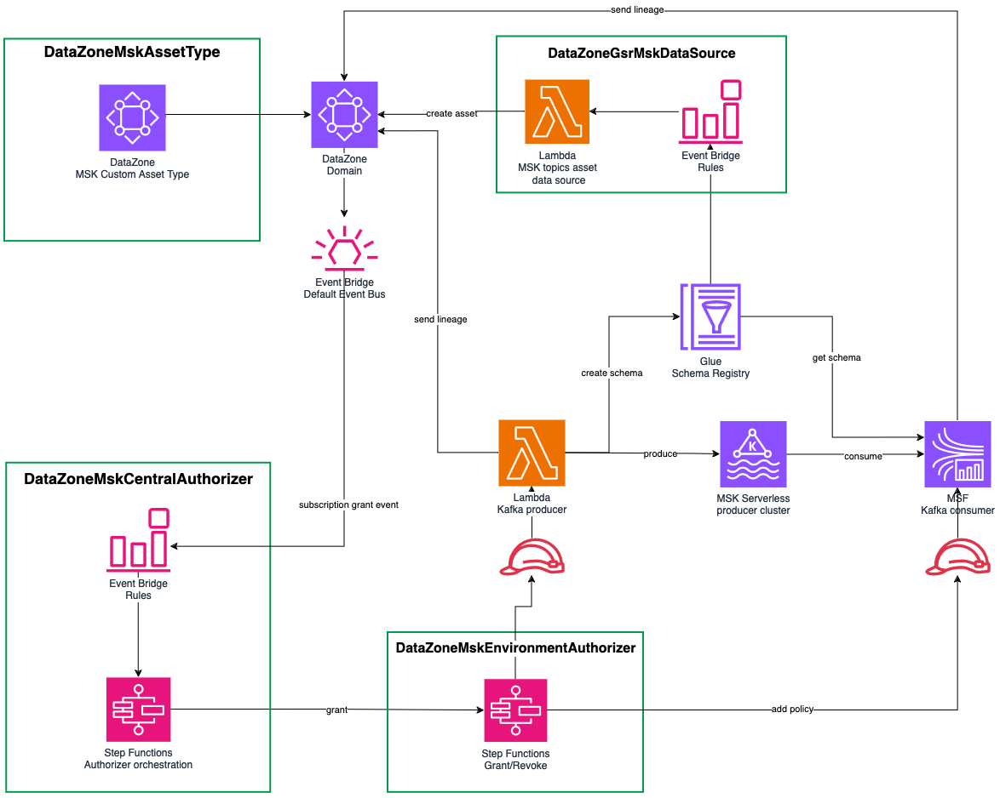

# Streaming governance with Amazon DataZone

Govern Kafka topics from Amazon MSK in DataZone. Store metadata including data lineage, schema and data format in DataZone's business catalog. Subscribe to MSK topics using the DataZone subscription and fulfillment workflows.

In this example, we will be using DSF on AWS to quickly build an end-to-end data governance solution for Kafka topics. The example provisions resources to illustrate a scenario where a Lambda based Kafka producer publishes a Kafka topic into Amazon DataZone to allow for discovery via its business catalog. The producer is using DSF on AWS to create the custom asset type in DataZone for MSK topics. DSF also provides a custom DataZone data source that automatically creates the asset in DataZone based on the producer's Glue schema Registry. After the asset is created, a consumer can browse the DataZone catalog and request access to the MSK topic. When approved by the producer team, DSF custom authorizer automatically grants the consumer access to the MSK topic from a Flink application running on Amazon Managed Streaming for Apache Flink. Both producer and consumer are registering lineage information into DataZone.

The AWS CDK application using the DSF on AWS contains a single stack which provisions the following DSF constructs:
   * [`DataZoneMskAssetType`](../constructs/library/04-Governance/03-datazone-msk-asset-type.mdx)
   * [`DataZoneGsrMskDataSource`](../constructs/library/04-Governance/05-datazone-msk-data-source.mdx)
   * [`DataZoneMskCentralAuthorizer` and `DataZoneMskEnvironmentAuthorizer`](../constructs/library/04-Governance/04-datazone-msk-authorizer.mdx)  

**This is what we will build in minutes and less than one hundred lines of codes!** Starting from scratch would require days and thousands of lines of code.

## Deployment guide

You can follow the [deployment guide](https://github.com/awslabs/data-solutions-framework-on-aws/tree/main/examples/datazone-msk-governance) from DSF on AWS GitHub repo to deploy the solution.